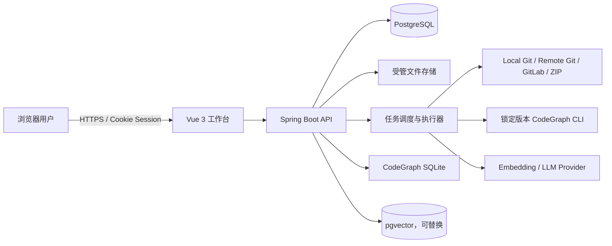
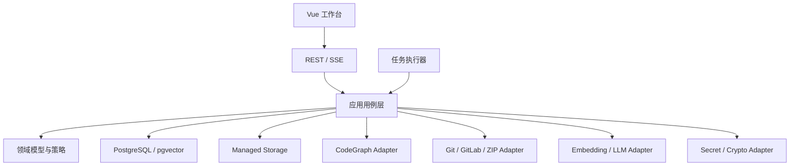
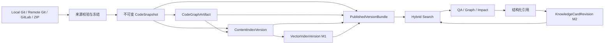
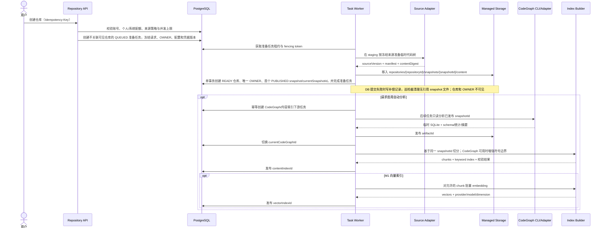
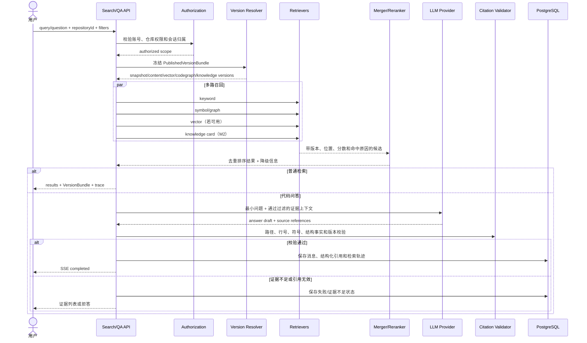
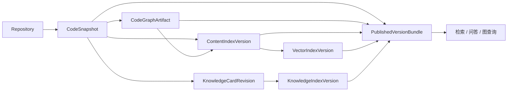
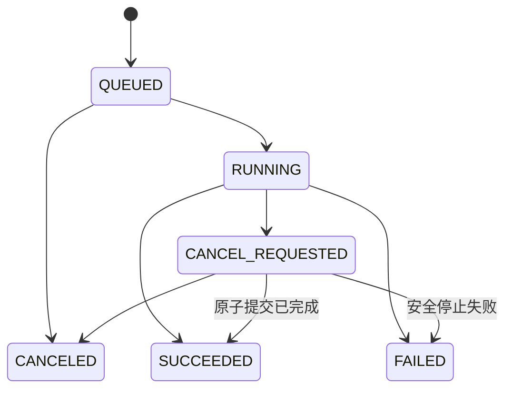
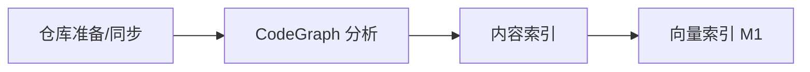
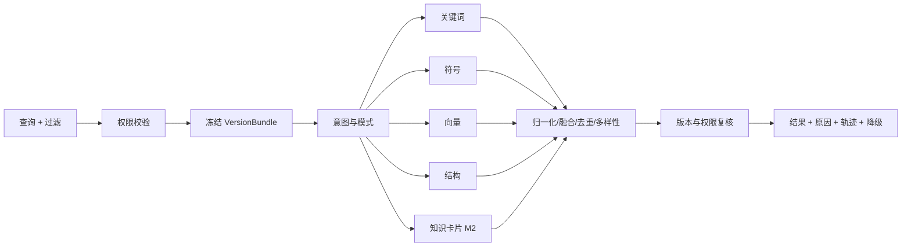
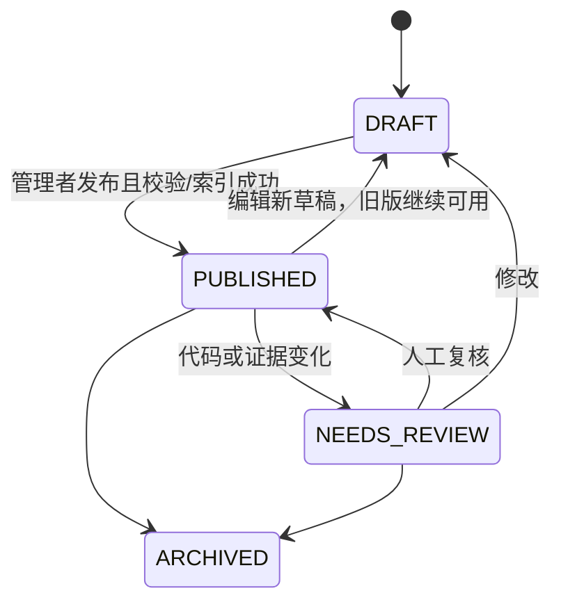

# 代码智库系统设计文档

版本：v1.1
日期：2026-07-22
状态：与需求 v1.1 对齐版
需求基线：`docs/01-requirements.md` v1.1
技术基线：`docs/02-tech-selection.md`

## 1. 目的、范围与里程碑

本文将当前需求中的账号与授权、四类仓库接入、不可变代码快照、CodeGraph、内容/向量索引、混合检索、代码问答、调用图、知识卡片、统一任务、系统设置和备份恢复，收敛为一套可实施的系统设计。

本文描述目标架构。当前仓库中的内存存储、简化 `index_jobs`、Noop 向量适配器和基础页面仅是工程骨架，不能视为需求已经实现。

| 里程碑 | 必须形成的闭环 | 明确不包含 |
| --- | --- | --- |
| M0 | 账号/会话/仓库授权；四类来源；不可变快照；CodeGraph 分析与结构查询；内容索引、关键词查询；统一任务；安全记录；配置；备份恢复 | embedding、向量检索、LLM 问答、多层调用图、知识卡片 |
| QV1 | 快速开始首页、一键准备、项目画像、快捷问题、跨页面联动；复用现有产物和任务 | 自定义路径、业务域地图、命令执行、自动改代码 |
| M1 | 向量索引；关键词/符号/向量/结构四路检索；单仓问答；引用校验；外发控制；入门总览、路径、进度、环境预检和基础场景链路 | 多仓问答、多层影响图、增量索引、知识卡片 |
| M2 | 增量索引；最多 5 仓联合代码检索；多层调用图与影响分析；知识卡片及独立索引；业务域地图、API/数据目录、变化摘要、术语和团队入门沉淀 | 跨仓调用图、多仓问答、运行时链路、自动改代码 |

### 1.1 架构不变量

1. **版本不混用**：一次查询只使用同一代码快照上的兼容产物组合。
2. **发布不覆盖**：快照和各类产物先临时构建、校验，再原子切换当前指针。
3. **失败不破坏旧版**：失败、取消或重启不损坏上一版可用产物。
4. **事实来源分层**：源码与 CodeGraph 是代码事实；知识卡片是人工语境；LLM 只总结证据。
5. **服务端权限闭环**：列表、计数、详情、流式输出、历史证据和任务日志均执行授权。
6. **仓库是不可信输入**：不执行仓库脚本、Git hooks、构建命令或仓库内指令。
7. **外发默认关闭**：系统、仓库、数据类别和敏感检测全部允许时才可外发。
8. **状态与错误稳定**：不用自由文本驱动状态迁移、重试和前端行为。
9. **全链路可追溯**：代码结果绑定仓库、快照、产物、文件和行号。
10. **删除不误删来源**：删除平台仓库绝不修改本地 Git 原目录。

## 2. 系统上下文与信任边界

M0 默认是单机或同机容器化的本地 Web 服务。浏览器不能直接读取客户端磁盘；本地 Git 路径必须位于服务端允许根目录。



| 边界 | 设计要求 |
| --- | --- |
| 浏览器 → API | 会话、CSRF、输入校验、输出编码、仓库授权 |
| 仓库/ZIP → Worker | 路径归一化、配额、敏感过滤、禁止执行、隔离目录 |
| API/Worker → 外部端点 | SSRF/DNS/TLS/重定向/端口/代理校验，最小外发 |
| Worker → CodeGraph CLI | 锁版本、最小环境变量、默认断网、资源/超时限制 |
| PostgreSQL → 文件存储 | 不可变对象、摘要、发布记录、可修复指针切换 |

## 3. 总体架构与模块边界

首期采用**模块化单体 + 独立任务执行线程/进程**。后续可拆分 API 与 Worker，但不改变领域状态、稳定 ID 和发布协议。



| 模块 | 核心职责 | 禁止越界 |
| --- | --- | --- |
| Identity & Access | 账号、密码、会话、锁定、仓库授权、安全事件 | 前端菜单代替权限 |
| Repository Lifecycle | 来源、凭据引用、冻结快照、同步、删除墓碑 | 修改本地原仓库 |
| Task Orchestrator | 幂等、依赖、锁、租约、心跳、取消、恢复 | 用任务失败覆盖产物状态 |
| CodeGraph | CLI、导入、schema 校验、稳定查询端口 | 业务依赖原始表结构 |
| Index | 过滤、chunk、关键词/向量版本、发布 | 生成摘要混入原始证据 |
| Hybrid Search | 路由、多路召回、冻结版本、融合、降级 | 语义结果推断调用边 |
| Question Answering | 会话、上下文、LLM、SSE、引用校验、拒答 | 对话历史替代当轮证据 |
| Graph & Impact | 遍历、路径、聚合、风险因素、测试候选 | 静态图冒充运行时事实 |
| Knowledge Card | 修订、发布、复核、索引、冲突提示 | 未经人工确认自动发布 |
| Developer Onboarding | 系统总览、学习路径、场景链路、运行手册、个人进度 | 复制代码事实或自动修改仓库 |
| Settings & Backup | 配置版本、密钥、影响预览、备份恢复 | 回滚历史明文密钥 |

依赖方向：

```text
interfaces -> application -> domain
worker     -> application -> domain
infrastructure ------------> domain ports
```

`domain` 不依赖 Spring、SQL、MyBatis、CodeGraph schema 或模型 SDK；Controller 不直接访问 Mapper、JDBC 或文件系统。infrastructure 层使用 MyBatis Mapper 实现领域持久化端口，CodeGraph SQLite adapter 例外地使用独立只读 JDBC。

### 3.1 核心数据流

数据流设计同时描述“数据从哪里来、落到哪里、绑定哪个版本、在哪个边界校验、失败时保留什么”。异步流程由 `taskId` 串联；代码证据由 `repositoryId + snapshotId + artifact/indexId` 定位。

#### 3.1.1 数据对象与流向

| 数据对象 | 产生方 | 主要落点 | 不可变/可变 | 关键关联 |
| --- | --- | --- | --- | --- |
| 登录会话 | Identity & Access | PostgreSQL | 可撤销 | accountId、sessionId |
| 仓库来源配置 | Repository Lifecycle | PostgreSQL | 版本化修改 | repositoryId、credentialVersion |
| 代码快照 | Source Adapter / Worker | 受管文件存储 + 元数据表 | 不可变 | snapshotId、sourceVersion、contentDigest |
| CodeGraph 产物 | CodeGraph Worker | 受管 SQLite + 元数据表 | 不可变 | artifactId、snapshotId、schemaVersion |
| 内容索引 | Index Worker | PostgreSQL/受管索引 | 不可变版本 | contentIndexId、snapshotId、artifactId |
| 向量索引 | Embedding Worker | pgvector + 元数据表 | 不可变版本 | vectorIndexId、contentIndexId、model |
| 检索轨迹 | Hybrid Search | PostgreSQL | 追加记录 | requestId、VersionBundle、strategyVersion |
| 问答消息与引用 | Question Answering | PostgreSQL | 消息追加、引用不可变 | messageId、VersionBundle、citationId |
| 知识卡片修订 | Knowledge Card | PostgreSQL + 知识索引 | 修订不可变 | cardId、revisionId、snapshotId |
| 安全/外发事件 | 安全策略与 Provider Adapter | PostgreSQL/审计日志 | 仅追加 | actor、repositoryId、requestId/taskId |
| 备份集与墓碑 | Backup / Delete Worker | 备份存储 + PostgreSQL | 不可变清单 | backupId、restorePoint、tombstoneId |

敏感数据按三类传递：认证秘密只进入身份校验或受限 Worker；代码正文只进入受管存储、索引和被授权的查询上下文；日志与指标仅记录摘要、数量、版本和关联 ID。

#### 3.1.2 端到端主数据流



主链路的原子边界是每个不可变版本的 `PUBLISH`。下游只消费已发布版本，不读取上游临时目录或 BUILDING 数据。

#### 3.1.3 仓库导入、分析与索引数据流



数据控制点：

1. 来源凭据只由 Source Adapter 在执行时解密，不写入快照、命令行、URL 或日志。
2. 快照发布后代码树只读；CodeGraph 与索引绑定显式 snapshotId。
3. SQLite、chunk 和向量先写临时版本，完整性校验通过才切换当前指针。
4. 任一阶段失败只留下任务记录与待清理临时数据，旧版本继续服务。
5. 新快照使旧产物变为 STALE，但不会用新源码搭配旧行号返回“最新结果”。
6. 已有仓库更新复用同一 staging、摘要和发布协议，但只在 MAINTAIN 及以上授权通过后创建任务；无变化返回 `SUCCEEDED + NO_CHANGE`，有变化时 CAS 切换 currentSnapshotId，失败保留当前快照。

#### 3.1.4 检索与问答数据流



查询文本在外部发送前执行长度与敏感检测。Provider 只记录模型、字符数、耗时和结果，不记录代码正文。权限在请求开始、详情读取、分页续取和 SSE 发送前复核；权限回收后不得继续输出缓存结果。

#### 3.1.5 图分析与知识沉淀数据流

调用图只读取冻结的 CodeGraph artifact；节点、边、路径和源码预览绑定同一 snapshot。确定性影响清单先生成，可选 LLM 只接收已加载图摘要。截断、关系不支持或动态行为无法确认等限制随结果返回。

知识卡片链路为：问答/检索/影响结果 → 复制必要引用元数据 → 保存 DRAFT 修订 → 人工编辑与发布校验 → 临时知识索引 → 原子发布修订与索引。代码变化触发引用摘要/符号/关系复核；命中变化的修订写入 NEEDS_REVIEW 和同步 denylist，先停止召回，再异步清理索引。

#### 3.1.6 权限、配置和删除控制流

| 控制事件 | 同步动作 | 异步动作 | 对已有数据的影响 |
| --- | --- | --- | --- |
| 仓库权限回收 | 新请求拒绝、列表/缓存/SSE 清除 | 无 | 已触发平台任务继续，用户失去可见性 |
| 账号停用 | 预览 OWNER 仓库、受管数据量、运行任务和名称冲突；原子完成必要重命名、全部所有权转移、停用与会话撤销 | 无 | 任一步失败整体回滚；业务主体、原授权记录与审计保留 |
| 外发策略收紧 | 阻止尚未发出的外部请求 | 可取消后续批次 | 已完成调用仅保留无正文元数据 |
| 过滤/切分规则变化 | 发布新配置版本 | 标记内容/向量索引 STALE | 旧版仍可追溯查询 |
| 模型/维度变化 | 发布新配置版本 | 标记向量索引 STALE | 内容索引不受影响 |
| 仓库删除 | DELETING + 墓碑 + 立即不可见 | 清理快照、产物、授权和缓存 | 本地原仓库不删除；历史证据按策略最小保留 |

#### 3.1.7 备份与恢复数据流

备份从 PostgreSQL 一致性恢复点读取业务元数据、配置/凭据密文、任务/审计、产物清单和删除墓碑；受管文件按清单复制或记录“可重建但未备份”。每个 backup item 保存摘要和依赖版本。

恢复不直接覆盖在线数据：预检 → 维护模式 → 恢复前安全备份 → 隔离恢复数据库/文件 → 校验 schema、摘要、密钥和指针 → 应用删除墓碑 → 原子切换 → 使旧会话失效。缺失的可重建产物标记为 STALE 并创建重建任务，不伪装已恢复。

#### 3.1.8 数据流一致性检查

| 检查点 | 必须成立的条件 | 失败处理 |
| --- | --- | --- |
| 快照发布 | manifest、contentDigest 与最终路径一致 | 不切指针，清理临时数据 |
| CodeGraph 发布 | schema 兼容、SQLite 完整、最小查询和行号合法 | 旧 artifact 继续服务 |
| 内容索引发布 | chunk 数量/摘要/路径/行号/抽样查询通过 | 不发布半成品 |
| 向量索引发布 | 模型维度一致，必需 chunk 全部完成 | 保留上一向量版本 |
| 检索返回 | 候选属于冻结 VersionBundle 和授权范围 | 丢弃违规候选并记录完整性告警 |
| 问答完成 | 仓库事实均由有效引用支持 | 降级为证据列表或拒答 |
| 卡片召回 | 当前修订已发布、不在 denylist、适用版本成立 | 跳过并记录状态原因 |
| 恢复开放 | 权限、墓碑、指针、摘要和凭据校验通过 | 保持维护模式并回退 |
## 4. 领域模型与版本链

| 聚合/实体 | 标识 | 关键状态/语义 |
| --- | --- | --- |
| Account / Session | account_id / session_id | PASSWORD_CHANGE_REQUIRED、ENABLED、LOCKED、DISABLED；可撤销会话 |
| Repository / Ownership / Grant | repository_id | 唯一 ownerAccountId + ownershipVersion；READ/MAINTAIN/MANAGE 授权 |
| CodeSnapshot | snapshot_id | 已发布后不可变；sourceVersion、contentDigest、manifest；所有分析的代码事实边界 |
| CodeGraphArtifact | artifact_id | BUILDING、PUBLISHED、STALE、FAILED、DELETING；ABSENT 为无记录视图 |
| Content/Vector Index | index_id | BUILDING、PUBLISHED、STALE、FAILED、DELETING；内容与向量状态独立 |
| Task | task_id | 统一六态；冻结输入、配置、凭据和策略 |
| QA Session/Message | session_id / message_id | 私人会话；消息绑定证据版本 |
| Knowledge Card/Revision | card_id / revision_id | DRAFT、PUBLISHED、NEEDS_REVIEW、ARCHIVED |
| ConfigVersion / BackupSet | version_id / backup_id | 不可变配置；可校验恢复点 |

快照语义：

- `working-copy` 是来源适配器维护的可变准备区，下一次远程同步或 ZIP 更新可以替换；本地 Git 原目录始终是平台外部输入。
- `CodeSnapshot` 是一次来源准备完成后发布的完整只读代码副本。发布后内容和 manifest 不可修改，只能创建新 snapshot 并切换 `current_snapshot_id`。
- CodeGraph、内容/向量索引、检索、问答、调用图、知识引用和源码预览都必须绑定明确的已发布 snapshot；不得直接读取可变 working copy 或本地 Git 原目录。
- 快照不是备份。快照提供业务版本稳定性和历史证据复现，备份提供数据库或文件损坏后的灾难恢复。

仓库所有权模型：

- `repositories.owner_account_id NOT NULL` 是 OWNER 唯一事实来源，OWNER 不重复写入 grant。`normalized_name` 保存去除首尾空格并统一小写后的名称；对未删除记录建立 `(owner_account_id, normalized_name)` 部分唯一索引。仓库外键和 API 只使用不可变 repositoryId。
- `repositories.ownership_version` 对授权、转移和账号停用批量接管提供乐观锁。
- `repository_grants(repository_id, account_id)` 唯一，权限仅为 READ、MAINTAIN、MANAGE。
- `repository_governance_locks` 或等价数据库锁使授权、所有权转移和删除互斥。
- 旧数据迁移由 `APP_REPOSITORY_MIGRATION_OWNER` 指定启用超级管理员接管；无法完成唯一 OWNER 校验时不开放服务。
- OWNER 转移事务同时更新 owner、处理旧 OWNER 后续权限、递增版本、清理权限缓存并写 outbox 审计事件。



查询开始时冻结 `PublishedVersionBundle`。只选择显式绑定目标快照的已发布产物；向量版本必须绑定内容索引；内容索引始终绑定快照，CodeGraph 关联可空，使用符号边界切分时才绑定对应 CodeGraph artifact。缺少或不一致的通道直接标记不可用，不跨快照拼装。

`ABSENT`、`BUILDING`、`PUBLISHED`、`STALE`、`FAILED`、`DELETING` 是统一产物状态，不与任务六态混用。兼容性问题使用稳定错误码表达，不新增同义状态；最近任务失败可与旧 PUBLISHED/STALE 产物继续可用同时存在。

## 5. 数据与存储设计

### 5.1 存储分工

| 存储 | 数据 | 规则 |
| --- | --- | --- |
| PostgreSQL | 身份、授权、仓库、版本清单、任务、配置、审计、问答、卡片 | 当前指针权威来源；Flyway 默认开启并负责全部 schema 迁移 |
| pgvector（M1） | chunk embedding | 按 `vector_index_id` 隔离 |
| 受管文件存储 | 快照、CodeGraph SQLite、临时产物、备份 | 不可变、摘要校验 |
| CodeGraph SQLite | 单一产物版本的结构事实 | 只读，不写业务数据 |

```text
APP_MANAGED_DATA_ROOT/
  repositories/{repositoryId}/
    working-copy/                         # Remote Git / GitLab / ZIP；Local Git 可不存在
    snapshots/{snapshotId}/content/       # 已发布只读代码树
    artifacts/
      codegraph/{snapshotId}/{artifactId}/project/.codegraph/
      indexes/{snapshotId}/{indexId}/     # 可选文件型索引产物
  staging/{operationId}/                  # 构建和校验临时区
  backups/{backupId}/
```

`APP_MANAGED_DATA_ROOT` 是唯一受管数据根。每个仓库的工作副本、快照和文件型派生产物必须位于同一个 `repositories/{repositoryId}` 命名空间；PostgreSQL/pgvector 保存业务记录、当前指针、chunk 和向量。路径只由服务端不可变 ID 生成；解析后必须仍位于受管根目录。Local Git 原目录不属于受管数据，平台不移动或修改它，但分析使用的 snapshot 必须复制到统一仓库目录。

启动时校验受管根为绝对路径、可写、剩余空间满足硬下限，且 repositories、staging、backups 互不嵌套；生产环境拒绝源码目录和系统临时目录。容器部署必须显式挂载受管根和允许导入的本地目录。staging 失败数据由任务清理，宽限期后仍存在则告警并由巡检器回收。

### 5.2 MyBatis 持久化规范

- PostgreSQL 业务访问统一使用 MyBatis 3 和 `mybatis-spring-boot-starter`；不再引入 Spring Data JDBC、JPA/Hibernate 或 jOOQ。
- Mapper 接口放在 infrastructure 层，XML 与接口按模块一一对应；application/domain 只依赖持久化端口。Spring `@Transactional` 定义用例事务边界，Mapper 不自行开启或提交事务。
- SQL 参数使用 `#{}`；`${}` 禁止接收用户输入，只允许服务端白名单生成的标识符。复杂动态查询使用 `<if>`、`<choose>` 和 `<foreach>`，不得在业务服务中拼接 SQL。
- 账号、授权、OWNER、任务租约、当前版本和删除可见性查询使用显式 `resultMap` 与明确列清单；MyBatis 二级缓存关闭，不能用缓存代替数据库锁、ownershipVersion、fencing token 或权限复核。
- 游标分页、批量写入、`ON CONFLICT`、部分唯一索引配套查询、`FOR UPDATE SKIP LOCKED`、JSONB、数组和 pgvector 距离查询使用 PostgreSQL 原生 SQL。JSONB、数组、枚举和 vector 通过受测 TypeHandler 映射。
- Mapper 集成测试使用与生产同版本的 PostgreSQL/pgvector Testcontainers，覆盖 XML 解析、Flyway 后 schema、行映射、锁竞争、分页和向量维度；CodeGraph SQLite 使用单独只读 JDBC adapter 和连接配置。

### 5.3 目标表分组

- 身份：`accounts`、`account_sessions`、`repository_grants`、`security_events`、`rescue_tokens`。
- 仓库：`repositories`、`repository_sources`、`credentials`、`code_snapshots`、`deletion_tombstones`。
- 产物：`codegraph_artifacts`、`content_index_versions`、`vector_index_versions`、`artifact_references`。
- 检索：`code_chunks`、`chunk_search_documents`、`chunk_embeddings`、`retrieval_traces`。
- 任务：`tasks`、`task_dependencies`、`task_events`、`repository_locks`。
- 配置：`config_versions`、`config_entries`、`secret_entries`。
- 问答/知识：`qa_sessions`、`qa_messages`、`citations`、`knowledge_cards`、`knowledge_card_revisions`、`knowledge_index_versions`、`knowledge_chunks`、`knowledge_denylist`。
- 入门：`onboarding_paths`、`onboarding_steps`、`onboarding_progress`、`onboarding_bookmarks`、`onboarding_notes`、`project_glossary`、`onboarding_projections`。
- 备份：`backup_sets`、`backup_items`、`restore_runs`。

关键约束：规范化来源唯一；同一 OWNER 的未删除仓库 `normalized_name` 唯一；版本内容不可变；当前指针只能指向本仓库已发布产物；非终态任务具备幂等唯一约束；列表使用游标分页；UTC 存储；JSONB 不替代关键外键和状态。

生产 profile 禁止关闭 Flyway。启动时先执行迁移和后置完整性校验，再开放业务端口；迁移失败、pgvector 不可用、`APP_REPOSITORY_MIGRATION_OWNER` 无效或 OWNER/授权约束不成立时启动失败，不允许以内存存储降级运行。

## 6. 统一任务系统



终态不可回退；重试创建新任务并设置 `retryOf`；无变化使用 `SUCCEEDED + NO_CHANGE`。

通用阶段为：

```text
PREPARE -> VALIDATE -> EXECUTE -> VERIFY -> PUBLISH -> CLEANUP
```

1. 创建时冻结输入快照、配置、凭据和外发策略版本。
2. 获取全局额度与仓库租约后，以新 fencing token 运行。
3. Worker 在阶段边界和长循环检查取消、更新心跳。
4. `VERIFY` 校验摘要、数量、路径/行号和最小查询。
5. `PUBLISH` 是唯一修改当前指针的阶段，必须校验 fencing token 和预期旧指针。
6. 清理失败只告警，不改写主任务终态。

同仓库变更任务互斥，等锁任务保持 QUEUED 并展示阻塞任务。租约使用数据库时间、心跳和 fencing token 防双执行。服务启动时安全接管可恢复任务；无法确认副作用的任务以 `TASK_WORKER_LOST` 失败，不静默重放。



只有上游成功并发布满足条件的新产物时才启动下游。

任务读取、日志、结果、取消和重试每次按当前权限重新校验。READ 可查看授权仓库任务；普通任务仅任务创建者且当前至少具有 MAINTAIN 时可取消，OWNER 和超级管理员可按仓库治理权限操作；仓库删除、凭据清理、所有权迁移和恢复任务仅 OWNER 或超级管理员可操作。权限回收不强制取消平台已接管的安全任务，但原用户立即失去可见性和操作权。所有权转移不取消运行中的同步、分析或索引任务，新任务冻结新的治理版本；删除与所有权转移共用治理锁且不能并发成功。

## 7. 仓库生命周期

统一端口：

```java
public interface RepositorySourcePort {
    SourceProbeResult probe(SourceConfig config);
    PreparedSnapshot prepare(SnapshotRequest request, TaskWorkspace workspace);
}
```

| 适配器 | 来源版本 | 安全与一致性 |
| --- | --- | --- |
| LocalGitSource | branch、HEAD、已跟踪修改和未忽略未跟踪文件的工作区摘要 | 真实路径白名单；冻结复制；不 pull/checkout/reset 或写入原目录 |
| RemoteGitSource | URL、branch、commit | 禁 hooks/ext/交互提示；凭据不进 URL/日志；HTTPS 仅同源重定向；TLS/SSH/SSRF |
| GitLabSource | server、project、branch、commit | Token 引用；API/Git 共用网络策略 |
| ZipSource | uploadVersion、ZIP SHA-256、内容摘要 | 防 Zip Slip/Bomb；配额；禁设备文件/嵌套压缩 |

快照流程：临时获取或解压 → 安全扫描 → manifest/contentDigest → 无变化则 `NO_CHANGE` → 移入不可变目录 → 数据库事务切换 `current_snapshot_id` → 派生产物显示 STALE。文件移动后数据库失败产生的无引用对象由巡检回收；不得出现指针指向半成品。

删除只允许 OWNER 或超级管理员执行。删除预检展示受管数据、授权、任务、问答/知识影响和本地源目录保护说明；存在运行中写任务时拒绝删除，确认后事务内标记 `DELETING`、写墓碑、切断授权可见性并创建删除任务。异步清理失败保持 DELETING 并幂等续跑；本地 Git 原目录永不进入删除清单；历史证据按策略隐藏或匿名化，恢复旧备份时先应用墓碑，防止已删仓库复活。

## 8. CodeGraph 设计

平台分析和已有产物导入使用同一校验/发布协议。已有 `.codegraph` 只读校验后复制到受管目录，运行时不依赖用户目录。校验包括 CLI/schema 兼容、SQLite 完整性、必须表/字段、文件映射、行号、最小结构查询、摘要与规模。

构建阶段固定为准备分析副本 → 检测 CLI → 分析 → 校验 schema/完整性 → 统计节点和边 → 发布 → 清理。CLI 缺失、版本错误、超时、资源不足、产物不兼容和查询失败分别使用稳定错误码；失败、取消或不兼容不覆盖旧 PUBLISHED/STALE 产物。

MAINTAIN、MANAGE、OWNER 和超级管理员具有 `canBuildCodeGraph`，可首次构建、更新、重试和重新构建；READ 只能查看当前已发布图及过期状态。仓库操作入口和 CodeGraph/调用图页面调用同一 `codegraph-tasks` 接口；以 repositoryId、snapshotId、构建类型和幂等键建立非终态唯一约束，已有任务时返回同一 taskId，不重复创建。

CLI 使用参数数组启动，不经 shell；只读快照、独占输出目录、最小环境变量、默认断网，并限制 CPU、内存、磁盘、输出大小与超时。Windows/Linux 分别验证进程树终止、文件锁和路径语义。

```java
public interface CodeGraphPort {
    List<CodeSymbol> searchSymbols(GraphVersion graph, SymbolQuery query);
    Optional<CodeSymbol> getSymbol(GraphVersion graph, String symbolId);
    List<CodeSymbol> getFileSymbols(GraphVersion graph, String relativePath);
    CodeSource getSymbolSource(GraphVersion graph, String symbolId);
    List<CodeReference> getReferences(GraphVersion graph, String symbolId);
    GraphSlice getNeighbors(GraphVersion graph, String symbolId, Direction direction, int depth, GraphLimit limit);
    List<GraphPath> findPaths(GraphVersion graph, String fromSymbolId, String toSymbolId, GraphLimit limit);
}
```

`SqliteCodeGraphAdapter` 是唯一了解原始 schema 的模块，按 `(cliVersion, schemaVersion)` 选择映射。返回对象携带 repository/snapshot/artifact；同名符号返回候选集，不静默选中。

## 9. 内容索引与向量索引

M0 内容索引流水线：依赖校验 → 文件枚举 → 排除/大小/编码/敏感过滤 → CodeGraph 结构切分或文本降级切分 → 临时 chunk → 关键词索引 → 路径/行号/数量/摘要与抽样校验 → 原子发布。默认排除二进制、依赖目录、构建产物、`.git`、`.codegraph`、`.env`、私钥、证书、凭据文件和疑似密钥；这些类别不得因解析失败而回退进入索引。

源码按函数、方法、类、接口和模块切分；超长符号拆为有序子 chunk，保留父符号和行号。Markdown 按标题路径与段落切分。M0 不生成 LLM 摘要。

每个 chunk 至少绑定 contentIndex、repository、snapshot、file、language、start/end line、sequence、chunk/boundary/evidence type、contentDigest 和 chunkerVersion；CodeGraph artifact、symbol/parentSymbol 仅在结构切分可用时绑定，文本降级切分时为空并记录 `TEXT_FALLBACK`。父子/重叠 chunk 在检索时合并，不能伪装成多条证据。

M1 向量版本只使用一个 provider、模型和维度。仅处理允许的数据；批量调用不记录正文；必需 chunk 未完成时不发布新向量版本。模型、维度或外发规则变化仅使向量版本过期，不破坏内容索引。

M2 增量索引仅优化构建，不改变完整新版本和原子发布。Git diff 用摘要复核，ZIP 默认全量；规则、模型、维度或 schema 变化强制全量；删除/重命名不得留下孤儿 chunk。

## 10. 混合检索



提供自动、综合、关键词、语义、符号和调用关系模式。用户手选模式不静默切换；自动/综合可在单通道超时后降级，但返回 executed/skipped/degraded 通道和原因。

候选包含来源、证据位置、版本、通道原始分/标准分、命中原因和结构距离。精确符号、完整路径和确定性结构边优先；同文件、同符号、重叠行合并；限制单文件占比；知识卡片不覆盖代码事实。融合权重通过冻结评测集校准，并记录策略版本，不固定未经验证的永久公式。

## 11. 代码问答（M1）

会话由创建者私有并绑定一个仓库。默认固定创建时的版本组合；切换最新版本时创建会话版本分界，历史消息及引用不变。

SSE 事件：

```text
accepted -> retrieving -> evidence_ready -> generating*
         -> validating -> completed
                         -> insufficient_evidence | failed | stopped
```

流程：校验会话/权限/版本 → 有限历史做指代消解 → 混合检索 → 评估证据 → 构造带 Source ID 的最小上下文 → 调用允许的 LLM → 校验引用、路径、行号、版本和结构事实 → 成功保存或降级。证据不足时不调用模型或只返回证据列表，不能保存看似成功的无引用答案。

引用使用结构化记录：代码引用绑定仓库、快照、内容索引/CodeGraph、文件、行号、符号和证据类型；图引用绑定边/路径；卡片引用绑定修订和适用版本。所有仓库事实引用支持率必须为 100%。模型超时、限流或用户停止时保留已验证证据并把回答标记为未完成，可基于同一冻结证据重试；权限回收立即停止 SSE 和生成并禁止会话、答案与引用访问，重新授权后只恢复本人历史。

### 11.1 QV1 问答实现收敛

QV1 沿用 PostgreSQL 中现有 conversation/citation 记录，补充会话查询和消息关联，不先实现流式 token。`ask` 请求扩展为 `conversationId?`、`mode`、`selectedChunkIds` 和 `selectedSymbols`；所有客户端指定证据必须重新查询当前授权范围并校验会话 snapshot 与 contentHash，不能直接信任客户端正文。

```http
GET    /api/repositories/{repositoryId}/qa/conversations
POST   /api/repositories/{repositoryId}/qa/conversations
GET    /api/repositories/{repositoryId}/qa/conversations/{conversationId}
PATCH  /api/repositories/{repositoryId}/qa/conversations/{conversationId}
DELETE /api/repositories/{repositoryId}/qa/conversations/{conversationId}
POST   /api/repositories/{repositoryId}/qa/conversations/{conversationId}/messages
```

现有 `POST /api/repositories/{repositoryId}/ask` 在 QV1 保留为无会话兼容入口，内部调用同一问答应用服务。新消息响应增加 `answerSections`、`retrievalTraceSummary`、`citationCoverage`、`followUpSuggestions` 和 `versionStatus`；兼容字段 `answer` 与 `citations` 继续返回。

多轮只允许最近有限消息参与指代解析，默认 6 条且只传问题和短摘要；每轮重新执行检索和引用校验。结构化回答由确定性模板或允许的 provider 生成，最终均经过相同引用门禁。追问建议基于模式、引用符号和缺失段落生成，不单独调用模型。

前端 `AskView` 继续作为路由组合面，拆分为 ConversationList、QuestionComposer、AnswerMessage、EvidenceRail 和 SaveKnowledgeDraftDialog。会话、消息和证据篮由问答 feature store 统一管理；切换仓库立即清空，跨页只接收 chunkId/symbolId 等稳定 ID。
### 11.2 LLM Token 流式链路

定义 `LlmProviderPort.stream(GenerationRequest)`，基础设施层首个实现为 OpenAI-compatible streaming adapter。Provider DTO、鉴权、超时和流帧解析不得泄漏到 domain/application。密钥从加密配置读取并只在请求内存中使用；base URL 通过 OutboundNetworkPolicy 校验。

```text
POST message
  → permission/version/outbound preflight
  → persist ACCEPTED message attempt
  → retrieve + freeze evidence
  → provider stream
  → emit delta draft events
  → assemble candidate
  → citation validation
  → persist COMPLETED answer + citations
```

接口：

```http
POST /api/repositories/{repositoryId}/qa/conversations/{conversationId}/messages:stream
POST /api/repositories/{repositoryId}/qa/messages/{messageId}/stop
GET  /api/repositories/{repositoryId}/qa/messages/{messageId}
```

流式 POST 校验 CSRF 后返回 `text/event-stream; charset=UTF-8`。事件统一包含 `event`、`sequence`、`conversationId`、`messageId`、`requestId`、`occurredAt`；`delta` 只携带新增文本，`evidence_ready` 携带脱敏证据元数据，`completed` 携带最终结构化回答和已验证引用。心跳只维持连接，不改变业务状态。

消息尝试状态为 ACCEPTED、RETRIEVING、GENERATING、VALIDATING、COMPLETED、INSUFFICIENT_EVIDENCE、FAILED、STOPPED。草稿与最终答案分字段存储；只有 COMPLETED 进入正常历史展示和知识草稿入口。重试插入新 attemptId/retryOf，不改写原记录。

取消令牌同时连接 HTTP 断开、用户 stop、会话/权限撤销、任务超时和应用关闭。Provider 读取使用有界缓冲和单调 sequence；客户端按 sequence 去重。断线后的状态查询返回最后终态、已验证证据和未完成标记，不提供无限事件重放。

指标记录首 Token 延迟、总时长、输入证据字符、输出 Token、停止率、超时/限流/非法帧和引用失败，不记录正文。集成测试使用流式 stub，不依赖真实外部 Provider。
## 12. 调用图与影响分析（M2）

图查询固定单一 CodeGraph 产物，默认深度 ≤ 3、节点 ≤ 500。遍历使用 visited 集避免重复节点，同时保留环路边并记录最短深度。

返回分为：`graph`（节点、边、路径、聚合、截断）、`impactFacts`（直接/间接可能影响、下游、入口、模块、测试）和 `assessment`（HIGH/MEDIUM/LOW/NOT_ASSESSED、触发因素、限制）。仅结构关联测试标记“直接相关测试”；命名/目录/语义结果仅是“建议验证”。LLM 摘要失败不影响确定性图与清单。

## 13. 知识卡片（M2）



卡片与修订分离，已发布修订不可原地修改。新修订校验并完成知识索引后原子切换。撤回、归档、删除或待复核时，先同步写 `knowledge_denylist` 立即停止召回，再异步清理；清理失败不得恢复可见性。

快照变化后按文件删除/重命名、行摘要、符号签名和结构关系变化标记待复核。卡片与当前代码冲突时，代码事实优先并显示冲突。

## 14. 身份、权限与安全

### 14.1 身份与会话

密码固定使用 PBKDF2-SHA256，每个密码使用独立随机盐，迭代参数进入安全配置基线。密码长度 8 至 64 位、至少三类字符，不得等于用户名或命中弱密码表。会话使用高熵随机凭据，数据库只存摘要；Cookie 设置 HttpOnly、Secure、SameSite。状态修改使用 CSRF 防护。默认空闲 30 分钟、最长 12 小时；改密、重置、停用和安全恢复撤销相关旧会话。

登录失败返回统一错误；默认连续 3 次失败启用持久化验证码、5 次锁定 15 分钟，计数、验证码挑战和锁定状态持久化，服务重启不能绕过。临时密码仅显示一次、24 小时失效，首次成功使用后账号保持 `PASSWORD_CHANGE_REQUIRED`，完成改密前不能进入业务页面。

空数据库启动时只允许从环境变量创建唯一初始超级管理员，初始密码不写日志并强制首次改密。唯一管理员救援仅允许部署密钥与本机受限入口生成一次性令牌，无匿名远程重置 API，成功或失败均写审计。

审计以仅追加事件记录登录、退出、改密、账号、授权、所有权、凭据、配置、备份和删除操作，并支持时间、操作者、目标、仓库、事件和结果筛选。超级管理员读取全局安全事件；OWNER 仅能读取本人仓库的授权、所有权和凭据治理事件，响应排除平台安全事件与敏感详情；普通账号只能读取自己的最近登录摘要。

账号管理只允许超级管理员新增、编辑、启停、解锁和重置密码；不得停用或降级最后一个启用的超级管理员。M0 不物理删除账号，停用保留业务主体和历史审计；账号变更与必要会话撤销、审计事件在同一业务操作中完成，失败整体回滚。

### 14.2 授权

平台角色为 `SUPER_ADMIN`、`NORMAL`；所有启用账号都可创建仓库。创建事务把账号写为唯一 OWNER。普通授权为 `READ < MAINTAIN < MANAGE`，OWNER 是独立关系而不是第四种 grant：

- READ：查询仓库、任务、产物、问答、图和已发布知识。
- MAINTAIN：READ + 同步、分析、索引、任务取消和草稿维护。
- MANAGE：MAINTAIN + 非敏感配置和知识发布，不含授权、凭据、所有权和删除。
- OWNER：MANAGE + 成员授权、专用凭据、所有权转移和删除。
- SUPER_ADMIN：隐式管理所有仓库并可强制接管，但不自动获得他人私人问答正文。

授权服务统一返回 `relationship` 与 capabilities，至少包括 canUpdate、canIndex、canBuildCodeGraph、canConfigure、canGrant、canManageCredential、canTransferOwnership、canDelete。授权目标必须是启用账号；设置相同 READ/MAINTAIN/MANAGE 幂等返回当前结果。写授权必须携带期望 ownershipVersion，冲突返回最新版本；OWNER 不能通过普通 grant 接口修改自身 OWNER 身份，MANAGE 不能转授权限。用例入口和查询条件两层授权；读取详情、任务日志、源码、分页续取和 SSE 发送时再次校验。权限回收清理服务端缓存并终止后续输出。未授权对象不得通过名称、数量、所有者、版本、错误或耗时泄露。

所有权转移只允许 READY 或 AUTH_ERROR 仓库，目标必须是启用且非当前 OWNER 的账号，并要求影响预览和二次确认。账号停用服务先查询 OWNER 仓库、受管数据量和运行任务并要求目标接管账号，使用 ownershipVersion 逐仓校验，并预检目标 OWNER 下的 `normalized_name`；冲突仓库必须携带新名称映射。在同一事务完成必要重命名、批量转移和停用，任一冲突整体回滚。单仓所有权转移同样原子处理名称冲突。所有权转移默认不给旧 OWNER 保留权限，也可显式降为 READ、MAINTAIN 或 MANAGE。治理锁禁止转移与删除并发。

### 14.3 凭据、远程目标和外发

凭据使用信封加密，主密钥与业务库/备份分离。API 只支持写入、替换、清除和测试，读取只返回类型、掩码、状态和最近验证时间。仓库专用凭据绑定 repositoryId：OWNER 与超级管理员可新增、替换、停用和删除，MANAGE 只能使用或测试现有凭据；系统共享凭据仅超级管理员管理。普通账号创建远程仓库时可一次性写入该仓库专用凭据，但不能选择或查看其他账号、仓库或系统共享凭据。

替换凭据先验证后原子切换，任务继续使用冻结的 credentialVersion。删除仓库只解除引用；无引用专用凭据进入待清理，共享凭据不连带删除。认证失败时仓库进入 AUTH_ERROR，停止远程更新但保留当前快照只读。所有权转移不复制密文，只切换掩码管理能力并立即撤销旧 OWNER；Worker 通过冻结版本和短生命周期内存或受限临时文件使用凭据。

Git、GitLab、embedding 和 LLM 共用 `OutboundNetworkPolicy`：校验 scheme/host/port；DNS 解析及连接时复核 IP；拒绝回环、链路本地、云元数据和未允许内网；每次重定向重新校验且只允许同源跳转，不向其他来源转发凭据；HTTPS 校验证书/主机名；SSH 使用受管 known_hosts；代理不能绕过策略。

```text
allowExternal = providerEnabled
             && systemOutboundEnabled
             && repositoryPolicyAllows
             && dataCategoryAllows
             && sensitiveScanPassed
```

多仓请求只有全部仓库允许同一外发方式时才可外发。只记录 provider、模型、数据类别、字符数、策略版本和结果，不记录正文。

## 15. 配置中心

全局配置读取、修改、历史和连接测试仅允许超级管理员；普通账号不得获得配置数据。普通配置版本化，敏感配置单独加密。保存流程：读取当前版本 → 校验 → 影响预览 → 乐观锁提交新版本 → 发布配置事件。

每个配置声明 `IMMEDIATE`、`NEXT_TASK`、`REBUILD_REQUIRED` 或 `RESTART_REQUIRED`。过滤、切分、模型、维度和 schema 配置必须能计算受影响产物。普通配置回滚形成新版本；敏感值保持当前值或要求重新输入。

配置覆盖存储路径、Git/网络、任务资源、安全会话、索引切分、embedding、LLM、检索、CodeGraph、保留和备份。路径保存前验证绝对路径、允许根、权限、容量与嵌套；Git、GitLab、embedding 和 LLM 连接测试各自独立且失败不替换有效配置。自定义端点复用 OutboundNetworkPolicy。仓库外发策略为 INHERIT、LOCAL_ONLY、ALLOW_EXTERNAL，普通账号只能在仓库范围收紧，不能放宽系统策略；影响索引或模型语义的变更标记相关产物 STALE。

## 16. API 与错误设计

API 前缀 `/api/v1`，JSON 使用 camelCase。写接口接受 `Idempotency-Key`，更新接受 `If-Match`/version，列表使用 cursor，时间为 ISO-8601 UTC。长任务首次创建返回 `202 Accepted`；相同幂等键或非终态唯一约束命中时返回已有 taskId，不产生第二个任务。统一使用 `X-Request-Id`。

```http
POST /api/v1/auth/login
POST /api/v1/auth/logout
GET|POST|PATCH /api/v1/accounts[/{accountId}]
POST /api/v1/accounts/{accountId}/disable-preflight
POST /api/v1/accounts/{accountId}/disable

GET|POST /api/v1/repositories
GET|PATCH|DELETE /api/v1/repositories/{repositoryId}
POST /api/v1/repositories/{repositoryId}/deletion-preflight
GET /api/v1/repositories/{repositoryId}/grants
PUT|DELETE /api/v1/repositories/{repositoryId}/grants/{accountId}
POST /api/v1/repositories/{repositoryId}/ownership-transfer-preflight
POST /api/v1/repositories/{repositoryId}/ownership-transfers
GET|POST /api/v1/repositories/{repositoryId}/credentials
PUT|DELETE /api/v1/repositories/{repositoryId}/credentials/{credentialId}
POST /api/v1/repositories/{repositoryId}/credentials/{credentialId}/test
GET /api/v1/repositories/{repositoryId}/governance-events
POST /api/v1/repositories/{repositoryId}/refresh
POST /api/v1/repositories/{repositoryId}/codegraph-tasks
POST /api/v1/repositories/{repositoryId}/content-index-tasks
POST /api/v1/repositories/{repositoryId}/vector-index-tasks
GET /api/v1/repositories/{repositoryId}/symbols
GET /api/v1/repositories/{repositoryId}/chunks
GET /api/v1/repositories/{repositoryId}/source

POST /api/v1/search
POST /api/v1/qa/sessions
POST /api/v1/qa/sessions/{sessionId}/messages
GET /api/v1/qa/messages/{messageId}/events
POST /api/v1/qa/messages/{messageId}/stop
POST /api/v1/graph/queries
POST /api/v1/impact-analyses
GET|POST /api/v1/knowledge-cards
GET /api/v1/repositories/{repositoryId}/onboarding/overview
GET|POST /api/v1/repositories/{repositoryId}/onboarding/paths
GET|PUT /api/v1/repositories/{repositoryId}/onboarding/progress
GET /api/v1/repositories/{repositoryId}/onboarding/scenarios
POST /api/v1/repositories/{repositoryId}/onboarding/checks
GET|POST /api/v1/repositories/{repositoryId}/glossary
POST /api/v1/repositories/{repositoryId}/onboarding/exports

GET /api/v1/tasks
GET /api/v1/tasks/{taskId}
POST /api/v1/tasks/{taskId}/cancel
POST /api/v1/tasks/{taskId}/retries
GET|PUT /api/v1/settings
GET /api/v1/security-events
GET /api/v1/accounts/me/recent-logins
GET|POST /api/v1/backups
POST /api/v1/restores/preflight
POST /api/v1/restores
```

接口 DTO 显式区分 Git 与 ZIP 版本；ZIP 不伪造 branch/commit。源码读取必须带 snapshotId 或从冻结证据解析。

统一错误字段：`errorCode`、`category`、`summary`、`retryable`、`suggestedAction`、`requestId/taskId`、`occurredAt`。稳定类别为 AUTH、PERMISSION、VALIDATION、CONFLICT、NOT_FOUND、CREDENTIAL、DEPENDENCY、RESOURCE、TIMEOUT、INCOMPATIBLE、INTEGRITY、CANCELED、INTERNAL。前端不得解析文案决定行为。

## 17. 前端设计

前端采用 Vue 3 + TypeScript + Vite + Element Plus，Composition API 与 `<script setup>`。Pinia 只保存会话级跨页面状态，后端状态为唯一权威。

```text
src/
  app/                 # 启动、路由、权限守卫、全局错误
  features/            # auth/accounts/repositories/tasks/codegraph/indexing
                       # search/qa/graph/knowledge/onboarding/settings/backup
  shared/              # api/components/security/types
```

导航按里程碑、平台角色、relationship、服务端 capabilities 与依赖能力生成。普通账号显示仓库管理，但列表只含本人 OWNER 或已授权仓库；账号、全局审计、系统配置和备份仅超级管理员显示。不同 OWNER 的同名仓库同时可见时，列表和全局选择器显示仓库名、OWNER 展示名、来源类型，并使用 repositoryId 跳转和缓存。

OWNER 在仓库详情管理成员、专用凭据、所有权和仓库级治理事件；非 OWNER 不显示这些治理入口。账号停用界面展示 OWNER 仓库、受管数据量、运行任务和目标账号名称冲突，逐仓收集新名称后原子接管。当前仓库上下文持续显示来源版本和产物新鲜度。

CodeGraph 构建采用双入口但不同时作为同等级主按钮：仓库操作列“更多”菜单按 ABSENT/STALE/FAILED/BUILDING/PUBLISHED 显示“构建 CodeGraph”“更新 CodeGraph”“重新构建”“查看构建进度”或次级“重新构建”；CodeGraph/调用图页面在无产物空状态显示主按钮“立即构建”，过期/失败显示原因与更新/重试，PUBLISHED 时标题区只保留次级重建。READ 不显示构建按钮；两个入口只读取 `canBuildCodeGraph` 和同一任务状态，任一入口创建任务后另一入口立即切换到进度。

权限回收/会话失效时取消请求与 SSE，清除内存代码和问答。任务只展示真实状态、阶段、进度、阻塞原因、脱敏事件、取消和重试；失败任务与旧可用产物并列。危险操作提供影响预览和二次确认。Markdown、日志、源码和模型回答均安全渲染，前端不持久化明文敏感信息。关键操作支持键盘、可见焦点、语义标签和足够对比度；调用图提供表格/列表替代视图。桌面浏览器支持当前两个主要版本的 Chromium 和 Edge。未交付能力不生成菜单或假入口。

### 17.1 开发者入门工作台设计

入门工作台是聚合编排层，不建立第二套代码事实。`OnboardingApplicationService` 只读取当前授权范围内已发布的 snapshot、CodeGraph、内容索引、知识修订、任务和健康检查，再组装仓库总览、学习路径、场景链路和变化摘要。

```text
Onboarding UI
  → Overview / Path / Scenario / Runbook API
  → Onboarding Application Service
  → Repository + Artifact + Search + Graph + Knowledge ports
  → versioned projection / progress / private notes
```

数据模型：

- `onboarding_paths`：仓库路径头、目标角色、状态、版本、发布人和适用 snapshot 范围。
- `onboarding_steps`：不可变路径版本下的有序步骤，类型为 READ/RUN/TRACE/QUERY/VERIFY，保存目标、预计耗时、前置条件、证据引用和完成规则。
- `onboarding_progress`：账号、仓库、路径版本和步骤的状态、验证摘要与完成时间；不保存完整代码或命令输出。
- `onboarding_bookmarks`、`onboarding_notes`：个人收藏与私人笔记，读取必须匹配 accountId 并再次校验仓库权限。
- `project_glossary`：版本化术语、别名、业务域、人工解释、证据和发布状态。
- `onboarding_projections`：按 repositoryId、snapshotId、artifactVersion 生成的架构、业务域、API、数据模型、场景和变化摘要投影；投影可重建且不作为源码事实。

生成策略：轻量总览同步读取；架构地图、业务域地图、全量 API/数据目录和快照差异由统一任务生成临时投影，校验引用后原子发布。新快照将旧投影标记 STALE，已完成进度仍绑定旧版本；用户显式迁移到新路径版本。缺失 CodeGraph 时只提供文件/配置/文档级总览，禁止伪造调用路径。

场景链路的边必须带来源：静态调用来自 CodeGraph，HTTP/任务入口来自路由和配置扫描，数据访问来自 MyBatis Mapper/XML 与 Flyway，测试关系来自静态引用或人工知识。动态分派、反射、消息中间件和运行时配置显示候选或未知，不宣称唯一链路。

运行手册使用版本化 `runbook manifest`，声明 OS、工具、命令模板、允许参数、工作目录、超时、资源上限和是否仅复制。服务端执行仅允许超级管理员开启的受信任检查器，禁止 shell 拼接、仓库 hooks、任意脚本和敏感环境回显；执行产生统一任务和审计。

前端采用一个路由级 `OnboardingWorkspaceView` 作为组合面，子组件分别负责总览、路径步骤、场景链路、运行检查和个人收藏，props 下发、事件上抛；进度和当前路径由单一 feature store 管理。页面左侧为路径与进度，中间为当前步骤/链路，右侧为证据轨道和完成标准；移动到历史 snapshot 时持续显示版本提示。

权限：READ 使用已发布内容；MAINTAIN 编辑草稿；MANAGE/OWNER 发布仓库内容；超级管理员维护系统模板和受信任检查器。私人笔记不提供管理员读取接口。导出服务重新执行权限和引用检查，只输出元数据、短摘要与链接，不导出源码正文、密钥、完整日志或模型上下文。

### 17.2 QV1 快速开始设计

QV1 新增轻量 `QuickStartApplicationService`，只聚合现有 Repository、Artifact、Task、Chunk/Search、CodeGraph、QA 和 Knowledge 端口，不新增状态镜像表。四项就绪状态在请求时按当前 snapshot 和已发布产物计算；短时缓存键必须包含 accountId、repositoryId、snapshotId 和授权版本，权限变化主动失效。

```text
QuickStartView
  → GET quick-start overview
  → existing repositories / artifacts / tasks / chunks
  → existing search / ask / impact / knowledge APIs
  → cross-page route context
```

一键准备使用一个编排接口创建或返回现有任务链：检查当前 snapshot → 复用/创建 CodeGraph task → 复用/创建 content index task。幂等键为 repositoryId + snapshotId + pipeline type；任务依赖、终态不可改写、失败保留旧产物等规则沿用统一任务系统。

项目画像是可重建响应，不在 QV1 建新表：README 和构建文件线索来自内容索引，目录/语言/符号统计来自 chunk 与 CodeGraph，入口和测试只返回带证据候选。单项查询失败时返回 partial=true 和 unavailableSections，不使整个首页失败。

前端新增薄路由页 `QuickStartView`，由 ReadinessStrip、ProjectProfile、QuickQuestions、RecentTask 和 QuickActions 组成。仓库上下文来自已有 store；跨页跳转只传稳定 ID，目标页重新鉴权和加载，不通过路由状态携带源码正文。快速问题使用静态、可版本控制的模板，不引入模板管理后台。

新增接口：

```http
GET  /api/repositories/{repositoryId}/quick-start
POST /api/repositories/{repositoryId}/quick-start/prepare
```

其余操作复用现有 index、codegraph、search、ask、impact、task retry 和 knowledge API。QV1 不新增命令执行、学习进度、笔记或业务域持久化表；LLM 流式消息复用并扩展现有问答会话、消息和引用表。
## 18. 一致性、备份与恢复

跨数据库/文件发布不使用分布式事务，采用“不可变文件 + 数据库发布记录 + 可修复状态机”：临时构建并摘要 → 移到最终不可变路径 → 数据库事务插入产物并 CAS 切换指针 → 写发布事件。巡检器回收“有文件无记录”，并对“有指针无文件”告警和回退。

备份包含业务库、账号/授权、加密配置与凭据密文、任务/审计、产物元数据、删除墓碑和清单。大型快照/CodeGraph/索引可按策略不直接备份，但必须记录可重建来源、工具版本、预计时间与风险。默认每日备份，保留 7 个日备份和 4 个周备份；备份加密、生成不可变清单和完整性摘要，主密钥分离。只有完整性校验通过的任务结果进入 READY。

恢复流程：预检格式、版本、摘要、schema、空间、密钥、覆盖范围、停机影响和运行中写任务 → 维护模式并拒绝新业务写入/任务 → 等待或取消写任务 → 恢复前安全备份 → 隔离恢复数据库与文件 → 原子切换 → 应用删除墓碑和保留期 → 校验每个未删除仓库恰有一个有效 OWNER、同一 OWNER 下 `normalized_name` 唯一、grant 不含 OWNER 且唯一 → 校验指针、摘要、文件、产物与凭据 → 缺失产物标记 STALE 并创建任务 → 旧会话失效 → 退出维护模式。备份中的 OWNER 无效时，预检必须由超级管理员提供恢复接管映射；映射造成同名时同时提供新名称映射，禁止随机选择。

失败时回到恢复前状态，不开放混合版本。目标：业务元数据 RPO ≤ 24h、RTO ≤ 4h；未备份大型索引时基线规模检索恢复 ≤ 24h。每季度执行一次恢复演练，保存恢复点、耗时、校验结果、问题与整改记录。

## 19. 可观测性、性能与容量

HTTP、任务、检索、模型和发布事件携带 requestId、taskId、repositoryId、snapshotId 与产物 ID。日志不记录密码、Token、会话、完整代码、完整问题/回答或模型上下文。

指标覆盖 HTTP；任务队列、阶段、心跳和终态；文件/符号/chunk/向量规模；检索通道耗时、命中、降级；模型 token/错误/限流；存储与待清理量。告警覆盖任务失联、队列积压、磁盘不足、provider 失败、产物指针不一致、引用越界和异常登录。

普通账号默认所有者配额为 20 个非删除仓库、2 个并发仓库准备任务、20 GiB 受管数据。配额计量按 ownerAccountId 聚合 working copy、快照和派生产物；staging 失败数据在清理宽限期后不计费但必须告警。超级管理员跳过个人配额，不跳过系统磁盘和全局并发硬上限。

| 能力 | 服务端目标 |
| --- | --- |
| 登录/会话、任务查询/取消、100 仓列表 | P95 < 500ms |
| M0 关键词/chunk 前 20 条 | P95 < 2s |
| M1 四路检索前 20 条 | P95 < 3s |
| CodeGraph 直接关系查询 | P95 < 2s |
| 三层影响图 | P95 < 5s，达到节点/边/路径或耗时上限时明确截断 |
| 问答首个可见状态 | < 2s |
| M0 内容索引（10 万行基线） | < 15min |
| CodeGraph 全量分析 | < 30min，以锁定 CLI 基线为准 |

单实例基线：100 仓、单仓 10 万行/2 万文件/2GB；超限时拒绝、排队或提示调整，不能无保护耗尽资源。

## 20. 降级规则

- 自动/综合检索单路不可用时返回其他通道并明确降级；手选模式不可静默切换。
- 模型不可用时保留检索证据，问答不伪装成功。
- CodeGraph 不可用时普通检索可降级，调用关系/图查询不可执行。
- 新任务失败时旧产物继续可用。
- 源码归档时保留最小引用元数据，不跳转当前源码冒充原证据。
- 未知异常只返回 `INTERNAL_UNEXPECTED`、requestId 与安全摘要。

## 21. 测试、验收与追踪

测试层次：领域状态/权限/版本/外发单元测试；四类来源、CodeGraph schema、Provider 和存储契约测试；PostgreSQL 租约/fencing/指针/Flyway 集成测试；Zip Slip/Bomb、符号链接、命令注入、SSRF/DNS/TLS/SSH、XSS/CSRF、越权安全测试；进程中断、发布中断、磁盘不足、provider 超时、取消与发布竞争故障注入；按正式验收编号执行 E2E。

冻结 Java、TypeScript、Python 样例验证：定义定位 precision/recall ≥ 95%；直接关系 precision ≥ 95%、recall ≥ 90%；精确检索 Top-5 ≥ 95%；自然语言检索 Top-10 ≥ 90%；问答仓库事实引用支持率 100%；无效路径、越界行号和不存在符号为 0。

| 设计章节 | 需求章节 | 验收前缀 |
| --- | --- | --- |
| 4、5、7 | 4、5.2、6.3 | RM |
| 6、16、20 | 3.2、5.3、7.4 | TASK |
| 8 | 5.4 | CG |
| 9 | 5.5 | IDX、INCR |
| 10 | 5.6 | SRCH、MSRCH |
| 11 | 5.7 | QA |
| 12 | 5.8 | GRAPH、IMPACT |
| 13 | 5.9 | KC |
| 14 | 3.1、5.1、6.2、7.3 | AUTH、AM、RP、AUD |
| 15 | 5.10 | SET |
| 17 | 5.12 | UI |
| 18 | 5.11、6.4 | BAK |

当前验收范围以需求追踪表为准：AUTH-01..09、AM-01..07、AUD-01..02、RP-01..18、RM-01..29、TASK-01..15、CG-01..16、IDX-01..15、INCR-01..06、SRCH-01..17、MSRCH-01..07、QA-01..19、GRAPH-01..10、IMPACT-01..07、KC-01..19、UI-01..27、SET-01..15、BAK-01..11。

## 22. 实施分解与现有工程迁移

M0 建议顺序：

1. 新建目标 Flyway schema，引入 PostgreSQL/pgvector Testcontainers，并加入 MyBatis Mapper XML 启动解析测试。
2. 实现账号、会话、密码、授权、安全事件和初始管理员。
3. 建立 MyBatis Mapper、XML、TypeHandler 和持久化端口实现，用 PostgreSQL Repository/Snapshot 替换 `InMemoryCodeRepositoryStore`；移除业务代码中的 JdbcTemplate、Spring Data JDBC 和 jOOQ 使用。
4. 建立统一 Task、租约、恢复器，替换简化 `index_jobs` 和内存 Worker。
5. 建立受管存储和四类来源适配器。
6. 完成 CodeGraph CLI/已有产物导入、兼容矩阵和稳定查询端口。
7. 完成内容索引、关键词查询、引用定位与原子发布。
8. 完成配置、删除/清理、备份/恢复和 M0 页面闭环。

M1 增加 Embedding/Vector/LLM 端口、检索轨迹、SSE 问答和引用校验，不改变 M0 证据模型。M2 在既有版本协议上增加增量构建、多仓融合、图遍历与知识索引，不改变六态任务语义。需要扩容时优先拆 Worker，通过数据库领取、租约与 fencing token 扩展。

| 当前骨架 | 处置 |
| --- | --- |
| `V1__init_schema.sql` | 实验 schema；通过后续迁移重构，不作为生产基线 |
| 三个 `InMemory*Store` | 仅保留测试用途；正式 profile 禁用 |
| `SqliteCodeGraphAdapter` | 保留端口方向，按版本、兼容矩阵与只读安全重构 |
| `NoopVectorSearchAdapter` | M0 显示能力未交付；M1 替换真实实现 |
| 现有 Vue 页面 | 复用页面骨架，状态改为后端真实权限、任务与版本 |

## 23. 已定决策与待冻结参数

已定：模块化单体起步；PostgreSQL + pgvector；业务数据访问统一使用原生 MyBatis；Flyway 管理迁移；CodeGraph SQLite 使用独立只读 JDBC；受管不可变文件；固定检索流水线；外部模型默认关闭；Vue 3 工作台；统一六态任务。

实施前冻结：CodeGraph CLI 版本/schema 矩阵；ZIP、单仓、文件和系统硬上限（普通 OWNER 默认 20 仓、2 个并发准备任务、20 GiB 已确定）；Windows/Linux 部署组合；任务租约、心跳、取消和资源上限；chunk/过滤/敏感规则；M1 provider/模型/维度/预算；数据保留；备份和密钥托管；远程网段、端口、代理、TLS 与 SSH 策略。

这些参数进入可追踪配置基线和发布说明，不硬编码在业务代码中。
