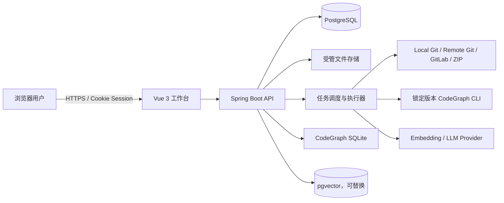
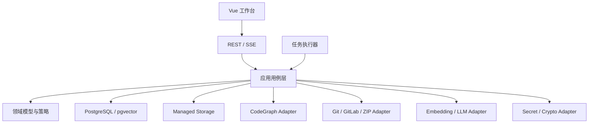
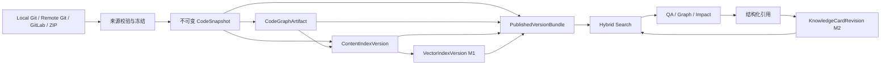
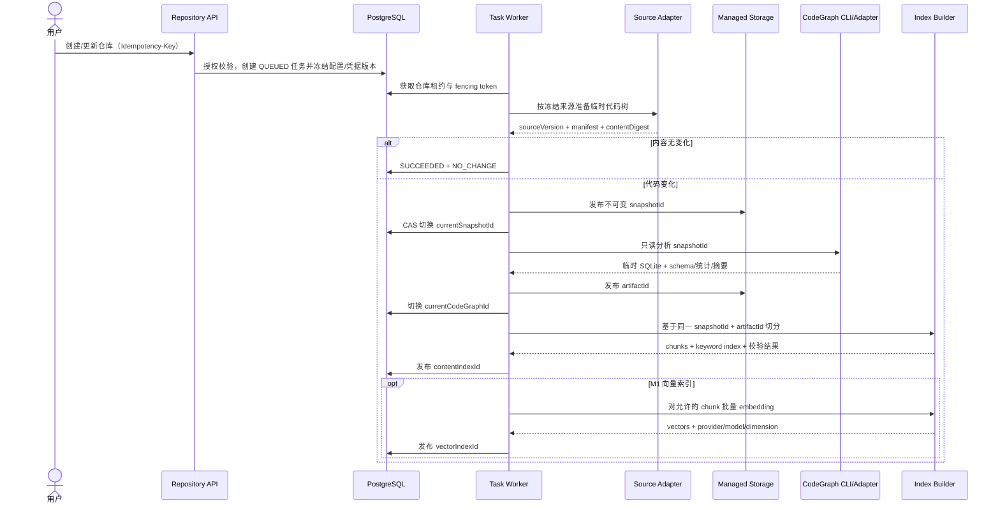
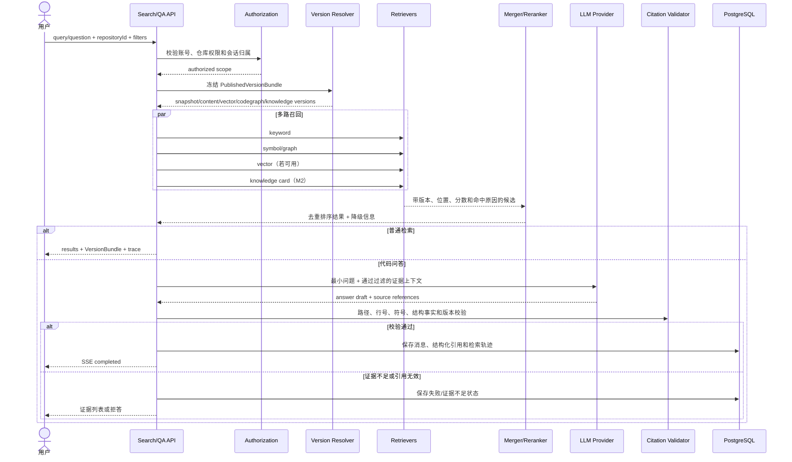
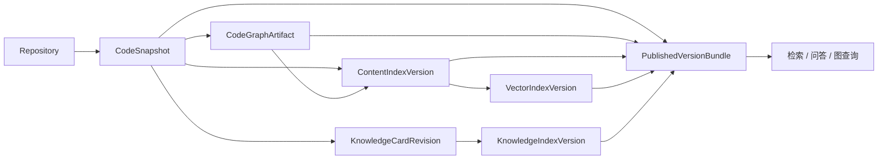
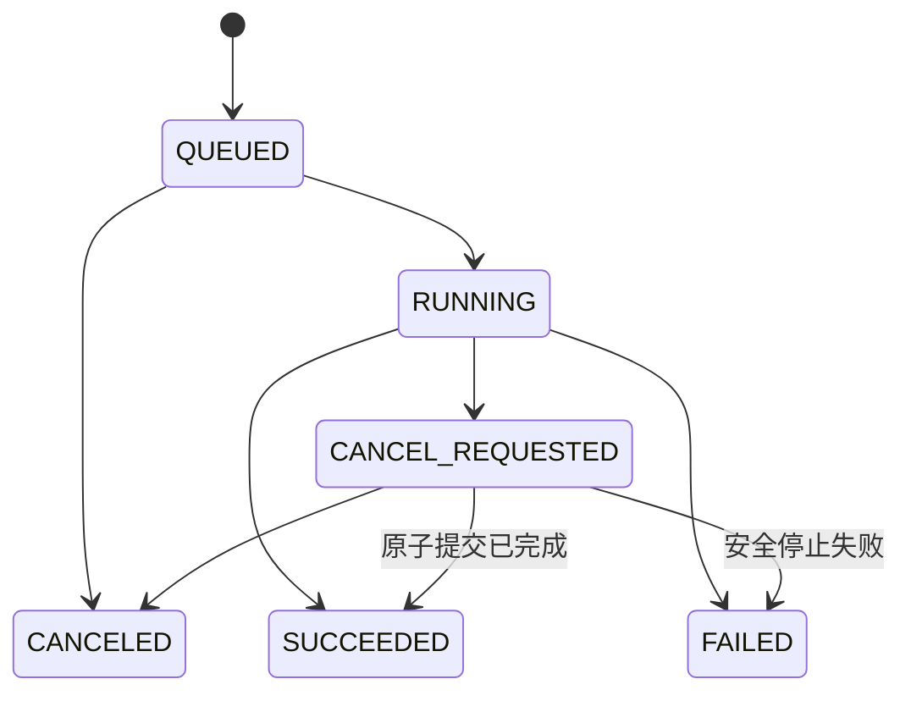
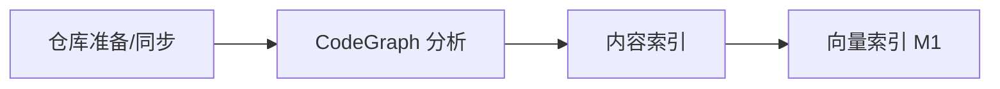
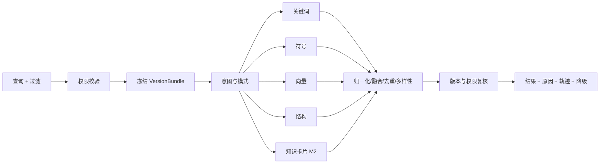
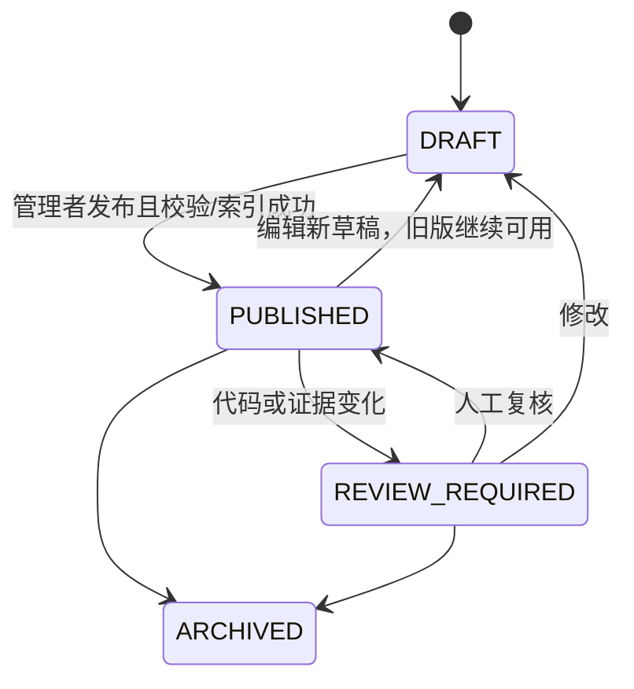

# 代码智库系统设计文档

版本：v1.0
日期：2026-07-21
状态：重新设计，待架构评审
需求基线：`docs/01-requirements.md`
技术基线：`docs/02-tech-selection.md`

## 1. 目的、范围与里程碑

本文将当前需求中的账号与授权、四类仓库接入、不可变代码快照、CodeGraph、内容/向量索引、混合检索、代码问答、调用图、知识卡片、统一任务、系统设置和备份恢复，收敛为一套可实施的系统设计。

本文描述目标架构。当前仓库中的内存存储、简化 `index_jobs`、Noop 向量适配器和基础页面仅是工程骨架，不能视为需求已经实现。

| 里程碑 | 必须形成的闭环 | 明确不包含 |
| --- | --- | --- |
| M0 | 账号/会话/仓库授权；四类来源；不可变快照；CodeGraph 分析与结构查询；内容索引、关键词查询；统一任务；安全记录；配置；备份恢复 | embedding、向量检索、LLM 问答、多层调用图、知识卡片 |
| M1 | 向量索引；关键词/符号/向量/结构四路检索；单仓问答；引用校验；外发控制 | 多仓问答、多层影响图、增量索引、知识卡片 |
| M2 | 增量索引；最多 5 仓联合代码检索；多层调用图与影响分析；知识卡片及独立索引 | 跨仓调用图、多仓问答、运行时链路、自动改代码 |

### 1.1 架构不变量

1. **版本不混用**：一次查询只使用同一代码快照上的兼容产物组合。
2. **发布不覆盖**：快照和各类产物先临时构建、校验，再原子切换当前指针。
3. **失败不破坏旧版**：失败、取消或重启不损坏上一版可用产物。
4. **事实来源分层**：源码与 CodeGraph 是代码事实；知识卡片是人工语境；LLM 只总结证据。
5. **服务端权限闭环**：列表、计数、详情、流式输出、历史证据和任务日志均执行授权。
6. **仓库是不可信输入**：不执行仓库脚本、Git hooks、构建命令或仓库内指令。
7. **外发默认关闭**：系统、仓库、数据类别和敏感检测全部允许时才可外发。
8. **状态与错误稳定**：不用自由文本驱动状态迁移、重试和前端行为。
9. **全链路可追溯**：代码结果绑定仓库、快照、产物、文件和行号。
10. **删除不误删来源**：删除平台仓库绝不修改本地 Git 原目录。

## 2. 系统上下文与信任边界

M0 默认是单机或同机容器化的本地 Web 服务。浏览器不能直接读取客户端磁盘；本地 Git 路径必须位于服务端允许根目录。



| 边界 | 设计要求 |
| --- | --- |
| 浏览器 → API | 会话、CSRF、输入校验、输出编码、仓库授权 |
| 仓库/ZIP → Worker | 路径归一化、配额、敏感过滤、禁止执行、隔离目录 |
| API/Worker → 外部端点 | SSRF/DNS/TLS/重定向/端口/代理校验，最小外发 |
| Worker → CodeGraph CLI | 锁版本、最小环境变量、默认断网、资源/超时限制 |
| PostgreSQL → 文件存储 | 不可变对象、摘要、发布记录、可修复指针切换 |

## 3. 总体架构与模块边界

首期采用**模块化单体 + 独立任务执行线程/进程**。后续可拆分 API 与 Worker，但不改变领域状态、稳定 ID 和发布协议。



| 模块 | 核心职责 | 禁止越界 |
| --- | --- | --- |
| Identity & Access | 账号、密码、会话、锁定、仓库授权、安全事件 | 前端菜单代替权限 |
| Repository Lifecycle | 来源、凭据引用、冻结快照、同步、删除墓碑 | 修改本地原仓库 |
| Task Orchestrator | 幂等、依赖、锁、租约、心跳、取消、恢复 | 用任务失败覆盖产物状态 |
| CodeGraph | CLI、导入、schema 校验、稳定查询端口 | 业务依赖原始表结构 |
| Index | 过滤、chunk、关键词/向量版本、发布 | 生成摘要混入原始证据 |
| Hybrid Search | 路由、多路召回、冻结版本、融合、降级 | 语义结果推断调用边 |
| Question Answering | 会话、上下文、LLM、SSE、引用校验、拒答 | 对话历史替代当轮证据 |
| Graph & Impact | 遍历、路径、聚合、风险因素、测试候选 | 静态图冒充运行时事实 |
| Knowledge Card | 修订、发布、复核、索引、冲突提示 | 未经人工确认自动发布 |
| Settings & Backup | 配置版本、密钥、影响预览、备份恢复 | 回滚历史明文密钥 |

依赖方向：

```text
interfaces -> application -> domain
worker     -> application -> domain
infrastructure ------------> domain ports
```

`domain` 不依赖 Spring、SQL、CodeGraph schema 或模型 SDK；Controller 不直接访问 JDBC 或文件系统。

### 3.1 核心数据流

数据流设计同时描述“数据从哪里来、落到哪里、绑定哪个版本、在哪个边界校验、失败时保留什么”。异步流程由 `taskId` 串联；代码证据由 `repositoryId + snapshotId + artifact/indexId` 定位。

#### 3.1.1 数据对象与流向

| 数据对象 | 产生方 | 主要落点 | 不可变/可变 | 关键关联 |
| --- | --- | --- | --- | --- |
| 登录会话 | Identity & Access | PostgreSQL | 可撤销 | accountId、sessionId |
| 仓库来源配置 | Repository Lifecycle | PostgreSQL | 版本化修改 | repositoryId、credentialVersion |
| 代码快照 | Source Adapter / Worker | 受管文件存储 + 元数据表 | 不可变 | snapshotId、sourceVersion、contentDigest |
| CodeGraph 产物 | CodeGraph Worker | 受管 SQLite + 元数据表 | 不可变 | artifactId、snapshotId、schemaVersion |
| 内容索引 | Index Worker | PostgreSQL/受管索引 | 不可变版本 | contentIndexId、snapshotId、artifactId |
| 向量索引 | Embedding Worker | pgvector + 元数据表 | 不可变版本 | vectorIndexId、contentIndexId、model |
| 检索轨迹 | Hybrid Search | PostgreSQL | 追加记录 | requestId、VersionBundle、strategyVersion |
| 问答消息与引用 | Question Answering | PostgreSQL | 消息追加、引用不可变 | messageId、VersionBundle、citationId |
| 知识卡片修订 | Knowledge Card | PostgreSQL + 知识索引 | 修订不可变 | cardId、revisionId、snapshotId |
| 安全/外发事件 | 安全策略与 Provider Adapter | PostgreSQL/审计日志 | 仅追加 | actor、repositoryId、requestId/taskId |
| 备份集与墓碑 | Backup / Delete Worker | 备份存储 + PostgreSQL | 不可变清单 | backupId、restorePoint、tombstoneId |

敏感数据按三类传递：认证秘密只进入身份校验或受限 Worker；代码正文只进入受管存储、索引和被授权的查询上下文；日志与指标仅记录摘要、数量、版本和关联 ID。

#### 3.1.2 端到端主数据流



主链路的原子边界是每个不可变版本的 `PUBLISH`。下游只消费已发布版本，不读取上游临时目录或 BUILDING 数据。

#### 3.1.3 仓库导入、分析与索引数据流



数据控制点：

1. 来源凭据只由 Source Adapter 在执行时解密，不写入快照、命令行、URL 或日志。
2. 快照发布后代码树只读；CodeGraph 与索引绑定显式 snapshotId。
3. SQLite、chunk 和向量先写临时版本，完整性校验通过才切换当前指针。
4. 任一阶段失败只留下任务记录与待清理临时数据，旧版本继续服务。
5. 新快照使旧产物变为 STALE，但不会用新源码搭配旧行号返回“最新结果”。

#### 3.1.4 检索与问答数据流



查询文本在外部发送前执行长度与敏感检测。Provider 只记录模型、字符数、耗时和结果，不记录代码正文。权限在请求开始、详情读取、分页续取和 SSE 发送前复核；权限回收后不得继续输出缓存结果。

#### 3.1.5 图分析与知识沉淀数据流

调用图只读取冻结的 CodeGraph artifact；节点、边、路径和源码预览绑定同一 snapshot。确定性影响清单先生成，可选 LLM 只接收已加载图摘要。截断、关系不支持或动态行为无法确认等限制随结果返回。

知识卡片链路为：问答/检索/影响结果 → 复制必要引用元数据 → 保存 DRAFT 修订 → 人工编辑与发布校验 → 临时知识索引 → 原子发布修订与索引。代码变化触发引用摘要/符号/关系复核；命中变化的修订写入 REVIEW_REQUIRED 和同步 denylist，先停止召回，再异步清理索引。

#### 3.1.6 权限、配置和删除控制流

| 控制事件 | 同步动作 | 异步动作 | 对已有数据的影响 |
| --- | --- | --- | --- |
| 仓库权限回收 | 新请求拒绝、列表/缓存/SSE 清除 | 无 | 已触发平台任务继续，用户失去可见性 |
| 账号停用 | 撤销全部会话 | 无 | 业务主体与审计保留 |
| 外发策略收紧 | 阻止尚未发出的外部请求 | 可取消后续批次 | 已完成调用仅保留无正文元数据 |
| 过滤/切分规则变化 | 发布新配置版本 | 标记内容/向量索引 STALE | 旧版仍可追溯查询 |
| 模型/维度变化 | 发布新配置版本 | 标记向量索引 STALE | 内容索引不受影响 |
| 仓库删除 | DELETING + 墓碑 + 立即不可见 | 清理快照、产物、授权和缓存 | 本地原仓库不删除；历史证据按策略最小保留 |

#### 3.1.7 备份与恢复数据流

备份从 PostgreSQL 一致性恢复点读取业务元数据、配置/凭据密文、任务/审计、产物清单和删除墓碑；受管文件按清单复制或记录“可重建但未备份”。每个 backup item 保存摘要和依赖版本。

恢复不直接覆盖在线数据：预检 → 维护模式 → 恢复前安全备份 → 隔离恢复数据库/文件 → 校验 schema、摘要、密钥和指针 → 应用删除墓碑 → 原子切换 → 使旧会话失效。缺失的可重建产物变为 NOT_BUILT 并创建重建任务，不伪装已恢复。

#### 3.1.8 数据流一致性检查

| 检查点 | 必须成立的条件 | 失败处理 |
| --- | --- | --- |
| 快照发布 | manifest、contentDigest 与最终路径一致 | 不切指针，清理临时数据 |
| CodeGraph 发布 | schema 兼容、SQLite 完整、最小查询和行号合法 | 旧 artifact 继续服务 |
| 内容索引发布 | chunk 数量/摘要/路径/行号/抽样查询通过 | 不发布半成品 |
| 向量索引发布 | 模型维度一致，必需 chunk 全部完成 | 保留上一向量版本 |
| 检索返回 | 候选属于冻结 VersionBundle 和授权范围 | 丢弃违规候选并记录完整性告警 |
| 问答完成 | 仓库事实均由有效引用支持 | 降级为证据列表或拒答 |
| 卡片召回 | 当前修订已发布、不在 denylist、适用版本成立 | 跳过并记录状态原因 |
| 恢复开放 | 权限、墓碑、指针、摘要和凭据校验通过 | 保持维护模式并回退 |
## 4. 领域模型与版本链

| 聚合/实体 | 标识 | 关键状态/语义 |
| --- | --- | --- |
| Account / Session | account_id / session_id | ENABLED、DISABLED；可撤销会话 |
| Repository / Grant | repository_id | ACTIVE、DELETING、DELETED；READ/MAINTAIN/MANAGE |
| CodeSnapshot | snapshot_id | 不可变；sourceVersion、contentDigest、manifest |
| CodeGraphArtifact | artifact_id | BUILDING、PUBLISHED、INCOMPATIBLE、RETIRED |
| Content/Vector Index | index_id | BUILDING、PUBLISHED、RETIRED |
| Task | task_id | 统一六态；冻结输入、配置、凭据和策略 |
| QA Session/Message | session_id / message_id | 私人会话；消息绑定证据版本 |
| Knowledge Card/Revision | card_id / revision_id | DRAFT、PUBLISHED、REVIEW_REQUIRED、ARCHIVED |
| ConfigVersion / BackupSet | version_id / backup_id | 不可变配置；可校验恢复点 |



查询开始时冻结 `PublishedVersionBundle`。只选择显式绑定目标快照的已发布产物；向量版本必须绑定内容索引；结构化内容索引必须绑定 CodeGraph。缺少或不一致的通道直接标记不可用，不跨快照拼装。

`AVAILABLE`、`STALE`、`NOT_BUILT`、`INCOMPATIBLE` 是产物视图状态，不与任务状态混用。最近任务失败可与旧产物可用同时存在。

## 5. 数据与存储设计

### 5.1 存储分工

| 存储 | 数据 | 规则 |
| --- | --- | --- |
| PostgreSQL | 身份、授权、仓库、版本清单、任务、配置、审计、问答、卡片 | 当前指针权威来源 |
| pgvector（M1） | chunk embedding | 按 `vector_index_id` 隔离 |
| 受管文件存储 | 快照、CodeGraph SQLite、临时产物、备份 | 不可变、摘要校验 |
| CodeGraph SQLite | 单一产物版本的结构事实 | 只读，不写业务数据 |

```text
managed/
  repositories/{repositoryId}/
    snapshots/{snapshotId}/tree/
    codegraph/{artifactId}/graph.sqlite
    indexes/content/{contentIndexId}/
    indexes/knowledge/{knowledgeIndexId}/
  tmp/{taskId}/
  backups/{backupId}/
```

路径只由服务端 ID 生成；解析后必须仍位于受管根目录。

### 5.2 目标表分组

- 身份：`accounts`、`account_sessions`、`repository_grants`、`security_events`、`rescue_tokens`。
- 仓库：`repositories`、`repository_sources`、`credentials`、`code_snapshots`、`deletion_tombstones`。
- 产物：`codegraph_artifacts`、`content_index_versions`、`vector_index_versions`、`artifact_references`。
- 检索：`code_chunks`、`chunk_search_documents`、`chunk_embeddings`、`retrieval_traces`。
- 任务：`tasks`、`task_dependencies`、`task_events`、`repository_locks`。
- 配置：`config_versions`、`config_entries`、`secret_entries`。
- 问答/知识：`qa_sessions`、`qa_messages`、`citations`、`knowledge_cards`、`knowledge_card_revisions`、`knowledge_index_versions`、`knowledge_chunks`、`knowledge_denylist`。
- 备份：`backup_sets`、`backup_items`、`restore_runs`。

关键约束：规范化来源唯一；版本内容不可变；当前指针只能指向本仓库已发布产物；非终态任务具备幂等唯一约束；列表使用游标分页；UTC 存储；JSONB 不替代关键外键和状态。

## 6. 统一任务系统



终态不可回退；重试创建新任务并设置 `retryOf`；无变化使用 `SUCCEEDED + NO_CHANGE`。

通用阶段为：

```text
PREPARE -> VALIDATE -> EXECUTE -> VERIFY -> PUBLISH -> CLEANUP
```

1. 创建时冻结输入快照、配置、凭据和外发策略版本。
2. 获取全局额度与仓库租约后，以新 fencing token 运行。
3. Worker 在阶段边界和长循环检查取消、更新心跳。
4. `VERIFY` 校验摘要、数量、路径/行号和最小查询。
5. `PUBLISH` 是唯一修改当前指针的阶段，必须校验 fencing token 和预期旧指针。
6. 清理失败只告警，不改写主任务终态。

同仓库变更任务互斥，等锁任务保持 QUEUED 并展示阻塞任务。租约使用数据库时间、心跳和 fencing token 防双执行。服务启动时安全接管可恢复任务；无法确认副作用的任务以 `TASK_WORKER_LOST` 失败，不静默重放。



只有上游成功并发布满足条件的新产物时才启动下游。

## 7. 仓库生命周期

统一端口：

```java
public interface RepositorySourcePort {
    SourceProbeResult probe(SourceConfig config);
    PreparedSnapshot prepare(SnapshotRequest request, TaskWorkspace workspace);
}
```

| 适配器 | 来源版本 | 安全与一致性 |
| --- | --- | --- |
| LocalGitSource | branch、HEAD、工作区摘要 | 真实路径白名单；冻结复制；不 pull/checkout/reset |
| RemoteGitSource | URL、branch、commit | 禁 hooks/ext；凭据不进 URL/日志；TLS/SSH/SSRF |
| GitLabSource | server、project、branch、commit | Token 引用；API/Git 共用网络策略 |
| ZipSource | uploadVersion、ZIP SHA-256、内容摘要 | 防 Zip Slip/Bomb；配额；禁设备文件/嵌套压缩 |

快照流程：临时获取或解压 → 安全扫描 → manifest/contentDigest → 无变化则 `NO_CHANGE` → 移入不可变目录 → 数据库事务切换 `current_snapshot_id` → 派生产物显示 STALE。文件移动后数据库失败产生的无引用对象由巡检回收；不得出现指针指向半成品。

删除时，事务内标记 `DELETING`、写墓碑、切断授权可见性并创建删除任务；异步清理平台数据。本地 Git 原目录永不进入删除清单；恢复旧备份时先应用墓碑，防止已删仓库复活。

## 8. CodeGraph 设计

平台分析和已有产物导入使用同一校验/发布协议。已有 `.codegraph` 只读校验后复制到受管目录，运行时不依赖用户目录。校验包括 CLI/schema 兼容、SQLite 完整性、必须表/字段、文件映射、行号、最小结构查询、摘要与规模。

CLI 使用参数数组启动，不经 shell；只读快照、独占输出目录、最小环境变量、默认断网，并限制 CPU、内存、磁盘、输出大小与超时。Windows/Linux 分别验证进程树终止、文件锁和路径语义。

```java
public interface CodeGraphPort {
    List<CodeSymbol> searchSymbols(GraphVersion graph, SymbolQuery query);
    Optional<CodeSymbol> getSymbol(GraphVersion graph, String symbolId);
    List<CodeSymbol> getFileSymbols(GraphVersion graph, String relativePath);
    CodeSource getSymbolSource(GraphVersion graph, String symbolId);
    List<CodeReference> getReferences(GraphVersion graph, String symbolId);
    GraphSlice getNeighbors(GraphVersion graph, String symbolId, Direction direction, int depth, GraphLimit limit);
    List<GraphPath> findPaths(GraphVersion graph, String fromSymbolId, String toSymbolId, GraphLimit limit);
}
```

`SqliteCodeGraphAdapter` 是唯一了解原始 schema 的模块，按 `(cliVersion, schemaVersion)` 选择映射。返回对象携带 repository/snapshot/artifact；同名符号返回候选集，不静默选中。

## 9. 内容索引与向量索引

M0 内容索引流水线：依赖校验 → 文件枚举 → 排除/大小/编码/敏感过滤 → CodeGraph 结构切分或文本降级切分 → 临时 chunk → 关键词索引 → 路径/行号/数量/摘要与抽样校验 → 原子发布。

源码按函数、方法、类、接口和模块切分；超长符号拆为有序子 chunk，保留父符号和行号。Markdown 按标题路径与段落切分。M0 不生成 LLM 摘要。

每个 chunk 至少绑定 contentIndex、repository、snapshot、CodeGraph artifact、file、language、symbol/parentSymbol、start/end line、sequence、chunk/boundary/evidence type、contentDigest 和 chunkerVersion。父子/重叠 chunk 在检索时合并，不能伪装成多条证据。

M1 向量版本只使用一个 provider、模型和维度。仅处理允许的数据；批量调用不记录正文；必需 chunk 未完成时不发布新向量版本。模型、维度或外发规则变化仅使向量版本过期，不破坏内容索引。

M2 增量索引仅优化构建，不改变完整新版本和原子发布。Git diff 用摘要复核，ZIP 默认全量；规则、模型、维度或 schema 变化强制全量；删除/重命名不得留下孤儿 chunk。

## 10. 混合检索



提供自动、综合、关键词、语义、符号和调用关系模式。用户手选模式不静默切换；自动/综合可在单通道超时后降级，但返回 executed/skipped/degraded 通道和原因。

候选包含来源、证据位置、版本、通道原始分/标准分、命中原因和结构距离。精确符号、完整路径和确定性结构边优先；同文件、同符号、重叠行合并；限制单文件占比；知识卡片不覆盖代码事实。融合权重通过冻结评测集校准，并记录策略版本，不固定未经验证的永久公式。

## 11. 代码问答（M1）

会话由创建者私有并绑定一个仓库。默认固定创建时的版本组合；切换最新版本时创建会话版本分界，历史消息及引用不变。

SSE 事件：

```text
accepted -> retrieving -> evidence_ready -> generating*
         -> validating -> completed
                         -> insufficient_evidence | failed | stopped
```

流程：校验会话/权限/版本 → 有限历史做指代消解 → 混合检索 → 评估证据 → 构造带 Source ID 的最小上下文 → 调用允许的 LLM → 校验引用、路径、行号、版本和结构事实 → 成功保存或降级。证据不足时不调用模型或只返回证据列表，不能保存看似成功的无引用答案。

引用使用结构化记录：代码引用绑定仓库、快照、内容索引/CodeGraph、文件、行号、符号和证据类型；图引用绑定边/路径；卡片引用绑定修订和适用版本。所有仓库事实引用支持率必须为 100%。

## 12. 调用图与影响分析（M2）

图查询固定单一 CodeGraph 产物，默认深度 ≤ 3、节点 ≤ 500。遍历使用 visited 集避免重复节点，同时保留环路边并记录最短深度。

返回分为：`graph`（节点、边、路径、聚合、截断）、`impactFacts`（直接/间接可能影响、下游、入口、模块、测试）和 `assessment`（HIGH/MEDIUM/LOW/NOT_ASSESSED、触发因素、限制）。仅结构关联测试标记“直接相关测试”；命名/目录/语义结果仅是“建议验证”。LLM 摘要失败不影响确定性图与清单。

## 13. 知识卡片（M2）



卡片与修订分离，已发布修订不可原地修改。新修订校验并完成知识索引后原子切换。撤回、归档、删除或待复核时，先同步写 `knowledge_denylist` 立即停止召回，再异步清理；清理失败不得恢复可见性。

快照变化后按文件删除/重命名、行摘要、符号签名和结构关系变化标记待复核。卡片与当前代码冲突时，代码事实优先并显示冲突。

## 14. 身份、权限与安全

### 14.1 身份与会话

密码使用 Argon2id 或当前批准的专用哈希。会话使用高熵随机凭据，数据库只存摘要；Cookie 设置 HttpOnly、Secure、SameSite。状态修改使用 CSRF 防护。默认空闲 30 分钟、最长 12 小时；改密、重置和停用撤销旧会话。

登录失败返回统一错误；默认 3 次启用验证码、5 次锁定 15 分钟。临时密码仅显示一次、24 小时失效。初始/救援流程仅允许部署密钥与本机受限入口，无匿名远程重置 API。

### 14.2 授权

平台角色为 `SUPER_ADMIN`、`NORMAL`；仓库权限为 `READ < MAINTAIN < MANAGE`。用例入口和查询条件两层授权；读取详情、源码、分页续取和 SSE 发送时再次校验。未授权对象不得通过名称、计数、错误或耗时泄露。超级管理员不自动获得他人问答正文。

### 14.3 凭据、远程目标和外发

凭据使用信封加密，主密钥与业务库/备份分离。API 只支持写入、替换、清除和测试，读取只返回掩码与验证状态。Worker 通过短生命周期内存或受限临时文件使用凭据。

Git、GitLab、embedding 和 LLM 共用 `OutboundNetworkPolicy`：校验 scheme/host/port；DNS 解析及连接时复核 IP；拒绝回环、链路本地、云元数据和未允许内网；每次重定向重新校验且跨源不转发凭据；HTTPS 校验证书/主机名；SSH 使用受管 known_hosts；代理不能绕过策略。

```text
allowExternal = providerEnabled
             && systemOutboundEnabled
             && repositoryPolicyAllows
             && dataCategoryAllows
             && sensitiveScanPassed
```

多仓请求只有全部仓库允许同一外发方式时才可外发。只记录 provider、模型、数据类别、字符数、策略版本和结果，不记录正文。

## 15. 配置中心

普通配置版本化，敏感配置单独加密。保存流程：读取当前版本 → 校验 → 影响预览 → 乐观锁提交新版本 → 发布配置事件。

每个配置声明 `IMMEDIATE`、`NEXT_TASK`、`REBUILD_REQUIRED` 或 `RESTART_REQUIRED`。过滤、切分、模型、维度和 schema 配置必须能计算受影响产物。普通配置回滚形成新版本；敏感值保持当前值或要求重新输入。

## 16. API 与错误设计

API 前缀 `/api/v1`，JSON 使用 camelCase。写接口接受 `Idempotency-Key`，更新接受 `If-Match`/version，列表使用 cursor，时间为 ISO-8601 UTC。长任务返回 `202 Accepted`。统一使用 `X-Request-Id`。

```http
POST /api/v1/auth/login
POST /api/v1/auth/logout
GET|POST|PATCH /api/v1/accounts[/{accountId}]
PUT /api/v1/accounts/{accountId}/repository-grants/{repositoryId}

GET|POST /api/v1/repositories
GET|PATCH|DELETE /api/v1/repositories/{repositoryId}
POST /api/v1/repositories/{repositoryId}/refresh
POST /api/v1/repositories/{repositoryId}/codegraph-tasks
POST /api/v1/repositories/{repositoryId}/content-index-tasks
POST /api/v1/repositories/{repositoryId}/vector-index-tasks
GET /api/v1/repositories/{repositoryId}/symbols
GET /api/v1/repositories/{repositoryId}/chunks
GET /api/v1/repositories/{repositoryId}/source

POST /api/v1/search
POST /api/v1/qa/sessions
POST /api/v1/qa/sessions/{sessionId}/messages
GET /api/v1/qa/messages/{messageId}/events
POST /api/v1/qa/messages/{messageId}/stop
POST /api/v1/graph/queries
POST /api/v1/impact-analyses
GET|POST /api/v1/knowledge-cards

GET /api/v1/tasks
GET /api/v1/tasks/{taskId}
POST /api/v1/tasks/{taskId}/cancel
POST /api/v1/tasks/{taskId}/retries
GET|PUT /api/v1/settings
GET /api/v1/security-events
GET|POST /api/v1/backups
POST /api/v1/restores/preflight
POST /api/v1/restores
```

接口 DTO 显式区分 Git 与 ZIP 版本；ZIP 不伪造 branch/commit。源码读取必须带 snapshotId 或从冻结证据解析。

统一错误字段：`errorCode`、`category`、`summary`、`retryable`、`suggestedAction`、`requestId/taskId`、`occurredAt`。稳定类别为 AUTH、PERMISSION、VALIDATION、CONFLICT、NOT_FOUND、CREDENTIAL、DEPENDENCY、RESOURCE、TIMEOUT、INCOMPATIBLE、INTEGRITY、CANCELED、INTERNAL。前端不得解析文案决定行为。

## 17. 前端设计

前端采用 Vue 3 + TypeScript + Vite + Element Plus，Composition API 与 `<script setup>`。Pinia 只保存会话级跨页面状态，后端状态为唯一权威。

```text
src/
  app/                 # 启动、路由、权限守卫、全局错误
  features/            # auth/accounts/repositories/tasks/codegraph/indexing
                       # search/qa/graph/knowledge/settings/backup
  shared/              # api/components/security/types
```

导航按里程碑、角色、仓库权限与依赖能力生成。当前仓库上下文持续显示来源版本和各产物新鲜度。权限回收/会话失效时取消请求与 SSE，清除内存代码和问答。任务只展示真实状态；失败任务与旧可用产物并列。Markdown、日志、源码和模型回答均安全渲染。调用图提供表格/列表替代视图。

## 18. 一致性、备份与恢复

跨数据库/文件发布不使用分布式事务，采用“不可变文件 + 数据库发布记录 + 可修复状态机”：临时构建并摘要 → 移到最终不可变路径 → 数据库事务插入产物并 CAS 切换指针 → 写发布事件。巡检器回收“有文件无记录”，并对“有指针无文件”告警和回退。

备份包含业务库、账号/授权、加密配置与凭据密文、任务/审计、产物元数据、删除墓碑和清单。大型快照/索引可按策略不直接备份，但必须记录可重建来源、版本与风险。备份加密、带摘要，主密钥分离。

恢复流程：预检 → 维护模式 → 等待/取消写任务 → 恢复前安全备份 → 隔离恢复 → schema/摘要/密钥/空间校验 → 原子切换 → 应用删除墓碑 → 校验账号、授权、指针与凭据 → 缺失产物标记待重建 → 旧会话失效 → 退出维护模式。

失败时回到恢复前状态，不开放混合版本。目标：业务元数据 RPO ≤ 24h、RTO ≤ 4h；未备份大型索引时基线规模检索恢复 ≤ 24h。

## 19. 可观测性、性能与容量

HTTP、任务、检索、模型和发布事件携带 requestId、taskId、repositoryId、snapshotId 与产物 ID。日志不记录密码、Token、会话、完整代码、完整问题/回答或模型上下文。

指标覆盖 HTTP；任务队列、阶段、心跳和终态；文件/符号/chunk/向量规模；检索通道耗时、命中、降级；模型 token/错误/限流；存储与待清理量。告警覆盖任务失联、队列积压、磁盘不足、provider 失败、产物指针不一致、引用越界和异常登录。

| 能力 | 服务端目标 |
| --- | --- |
| 登录/会话、任务查询/取消、100 仓列表 | P95 < 500ms |
| M0 关键词/chunk 前 20 条 | P95 < 2s |
| M1 四路检索前 20 条 | P95 < 3s |
| 深度 ≤ 3、节点 ≤ 500 图查询 | P95 < 2s |
| 问答首个可见状态 | < 2s |
| M0 内容索引（10 万行基线） | < 15min |
| CodeGraph 全量分析 | < 30min，以锁定 CLI 基线为准 |

单实例基线：100 仓、单仓 10 万行/2 万文件/2GB；超限时拒绝、排队或提示调整，不能无保护耗尽资源。

## 20. 降级规则

- 自动/综合检索单路不可用时返回其他通道并明确降级；手选模式不可静默切换。
- 模型不可用时保留检索证据，问答不伪装成功。
- CodeGraph 不可用时普通检索可降级，调用关系/图查询不可执行。
- 新任务失败时旧产物继续可用。
- 源码归档时保留最小引用元数据，不跳转当前源码冒充原证据。
- 未知异常只返回 `INTERNAL_UNEXPECTED`、requestId 与安全摘要。

## 21. 测试、验收与追踪

测试层次：领域状态/权限/版本/外发单元测试；四类来源、CodeGraph schema、Provider 和存储契约测试；PostgreSQL 租约/fencing/指针/Flyway 集成测试；Zip Slip/Bomb、符号链接、命令注入、SSRF/DNS/TLS/SSH、XSS/CSRF、越权安全测试；进程中断、发布中断、磁盘不足、provider 超时、取消与发布竞争故障注入；按正式验收编号执行 E2E。

冻结 Java、TypeScript、Python 样例验证：定义定位 precision/recall ≥ 95%；直接关系 precision ≥ 95%、recall ≥ 90%；精确检索 Top-5 ≥ 95%；自然语言检索 Top-10 ≥ 90%；问答仓库事实引用支持率 100%；无效路径、越界行号和不存在符号为 0。

| 设计章节 | 需求章节 | 验收前缀 |
| --- | --- | --- |
| 4、5、7 | 5.2、7 | RM |
| 6、16、20 | 5.11 | TASK |
| 8 | 5.3 | CG |
| 9 | 5.4 | IDX、INCR |
| 10 | 5.5 | SRCH、MSRCH |
| 11 | 5.6 | QA |
| 12 | 5.7 | GRAPH、IMPACT |
| 13 | 5.8 | KC |
| 14 | 5.1、6.4 | AUTH、AM、RP、AUD |
| 15 | 5.10 | SET |
| 17 | 5.9 | UI |
| 18 | 6.3、7.6 | BAK |

## 22. 实施分解与现有工程迁移

M0 建议顺序：

1. 新建目标 Flyway schema，引入 PostgreSQL Testcontainers。
2. 实现账号、会话、密码、授权、安全事件和初始管理员。
3. 用持久化 Repository/Snapshot 替换 `InMemoryCodeRepositoryStore`。
4. 建立统一 Task、租约、恢复器，替换简化 `index_jobs` 和内存 Worker。
5. 建立受管存储和四类来源适配器。
6. 完成 CodeGraph CLI/已有产物导入、兼容矩阵和稳定查询端口。
7. 完成内容索引、关键词查询、引用定位与原子发布。
8. 完成配置、删除/清理、备份/恢复和 M0 页面闭环。

M1 增加 Embedding/Vector/LLM 端口、检索轨迹、SSE 问答和引用校验，不改变 M0 证据模型。M2 在既有版本协议上增加增量构建、多仓融合、图遍历与知识索引，不改变六态任务语义。需要扩容时优先拆 Worker，通过数据库领取、租约与 fencing token 扩展。

| 当前骨架 | 处置 |
| --- | --- |
| `V1__init_schema.sql` | 实验 schema；通过后续迁移重构，不作为生产基线 |
| 三个 `InMemory*Store` | 仅保留测试用途；正式 profile 禁用 |
| `SqliteCodeGraphAdapter` | 保留端口方向，按版本、兼容矩阵与只读安全重构 |
| `NoopVectorSearchAdapter` | M0 显示能力未交付；M1 替换真实实现 |
| 现有 Vue 页面 | 复用页面骨架，状态改为后端真实权限、任务与版本 |

## 23. 已定决策与待冻结参数

已定：模块化单体起步；PostgreSQL + pgvector；受管不可变文件；CodeGraph SQLite 只读；固定检索流水线；外部模型默认关闭；Vue 3 工作台；统一六态任务。

实施前冻结：CodeGraph CLI 版本/schema 矩阵；ZIP/仓库/文件配额；Windows/Linux 部署组合；任务并发、租约、心跳、取消和资源上限；chunk/过滤/敏感规则；M1 provider/模型/维度/预算；数据保留；备份和密钥托管；远程网段、端口、代理、TLS 与 SSH 策略。

这些参数进入可追踪配置基线和发布说明，不硬编码在业务代码中。
