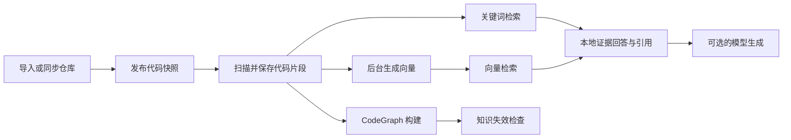

# 数据链路与实用性审计

> 历史审计记录：其中涉及的变更审查链路已删除，当前主链是代码与知识联合检索。

日期：2026-09-06。对象：当前源码与本地运行环境；不是已完成生产验收的声明。

## 判断

项目已具备仓库接入、快照隔离、代码片段、向量、知识卡片、图谱、问答和变更审查，但模块数量超过了当前真实链路的验证深度。实用价值应先落实为：用户交付一个仓库，系统能可靠找到真实源码，并明确展示当前可用能力及失败原因。

“整个数据流程没跑通”的感受有代码与环境两方面依据：准备流程存在不必要的依赖，状态统计可能与检索使用的模型不一致；本机默认数据库和后端也未运行。单元测试通过不能证明用户能完成导入到回答。

## 已确认并修复

| 问题 | 原来的真实行为 | 本次改变 |
| --- | --- | --- |
| 问答模型成为首次使用硬门槛 | REST 参数要求 modelConfigId；页面禁用无模型发送；测试用 Mock 绕过真实服务的模型校验 | modelConfigId 为空表示本地证据模式，页面提供明确选项并默认使用；不调用聊天模型；回答保留引用和 LOCAL_EVIDENCE_MODE 来源标识 |
| 搜索请求触发全仓库向量补建 | retrieve 调用 ensureCodeEmbeddings / ensureKnowledgeEmbeddings，逐条访问模型并写库 | 查询只计算查询文本向量并读取已有索引；补建保留在后台准备流程 |
| 切换模型后覆盖率仍是满的 | 向量统计只检查 chunk/card 是否存在向量记录，旧模型也被统计为可用 | 统计与缺失列表按当前模型、维度、检索能力及代码内容摘要过滤；知识向量还匹配卡片修订 |
| 向量降级截断图谱流程 | IndexJobProcessor 只有 vectorsReady 才入队图谱；前端遇到降级也立即退出；手动重试图谱要求完整向量 | 内容发布后继续图谱任务；图谱重试只要求内容索引；前端继续后续阶段；已降级快照不自动无限重试向量 |
| 准备尚未结束却报告完成 | 向量降级时，即使图谱与漂移检查仍未完成，也可以显示 DEGRADED 和“流程完成” | 必须完成图谱和知识检查后才报告流程完成；否则仍是 NOT_READY / PROCESSING / ACTION_REQUIRED |
| 空仓库索引假成功 | 零片段也可记录成功，下一次准备继续重复索引 | 没有可索引文本时直接失败，提示检查文件类型、大小与仓库路径 |
| 向量完成阶段忽略取消 | 构建向量期间收到的取消请求可能被随后成功状态覆盖 | 发布成功前增加取消检查，取消后不继续图谱 |
| 后台任务共享默认单调度线程 | 文件扫描、外部模型或 CodeGraph 执行会占住其他任务调度 | 默认配置四个调度线程，可通过 APP_WORKER_POOL_SIZE 调整；测试可关闭调度并显式运行处理器 |
| CI 和评测引用失效文件 | CI 执行不存在的 scripts/start.ps1；评测引用已合并删除的 V3 迁移文件 | CI 校验现有启动脚本和诊断入口；样本路径改为实际保留的 V1 基线，人工评审状态不变 |
| 缺少可操作的入口说明 | 根目录无 README，用户难以区分只启动前端与完整环境 | 新增最小闭环指南和无密钥输出的运行诊断脚本 |

主要实现位置：`IndexJobProcessor`、`RepositoryPreparationService`、`IntelligenceService`、`VectorIndexQueryMapper.xml`、`useProjectOverview.ts`、`AskView.vue`。

## 数据链路与能力边界

图表示数据依赖；当前实现仍在向量阶段结束后继续排队 CodeGraph，并非同仓库并行构建。向量降级不再截断该继续动作。CodeGraph 构建失败仍会显示需要处理，源码检索和本地证据回答则可独立使用。

本地证据模式是确定性摘录和来源展示，不是离线大模型。未配置外部向量模型时使用 64 维字符哈希；已配置外部向量模型时，查询仍可能调用该向量服务。外部模型能生成回答，也不能仅凭引用格式正确就声称结论已经被事实证明。

## 本次验证与运行环境

- 后端完整测试：253 项，失败 0，错误 0，跳过 2 项数据库集成测试入口。
- 前端：16 个测试文件、29 项测试通过。生产构建通过，现有大包警告仍存在。
- 评测与 CI 客户端：8 项脚本测试通过。
- MCP 适配层：8 项测试通过。
- 评测样本结构校验：50 个检索、30 个问答、20 个变更、10 个任务审查、8 个知识漂移样本通过路径和结构检查。
- `scoreable=false`：18 个任务审查/漂移样本仍待人工评审，不能声称已通过质量发布门禁。
- `RepositoryImportToAskIT` 已移除 LlmSettingsService Mock，覆盖真实内置向量服务、导入、索引、证据回答、历史恢复、模型切换与修复。
- 本次未完成 PostgreSQL/pgvector 集成执行，也未完成真实 CodeGraph 和外部模型验收：本机 Docker Linux 引擎连接失败，默认 5432、8080 服务不可达，当前终端未加载仓库根目录及受管存储配置，CodeGraph 不在命令路径中。

历史日志包含 ProjectKnowledgeHealthRow 构造器映射错误，但当前 XML 已使用正确的 `_long`，不可把该日志当作现存缺陷。本次在数据库集成测试增加该聚合查询调用，以验证实际 MyBatis 构造过程。

## 仍需解决的实用性缺口

| 优先级 | 缺口 | 下一项验收标准 |
| --- | --- | --- |
| P0 | 缺少当前运行环境的完整闭环证据 | 独立数据库下执行全部 IT，再通过真实 HTTP/浏览器完成导入、索引、搜索、回答、刷新历史 |
| P0 | 历史数据库升级路径不清楚 | 当前仅保留合并后的 V1，而旧文档描述 V1–V8；对旧库做非破坏性迁移演练，禁止通过删库或强制 repair 掩盖 checksum/schema 不兼容 |
| P1 | 普通内容索引缺少完善的超时和进程崩溃恢复 | 终止索引进程并重启，遗留 RUNNING 能在期限内转为可重试；不会永久锁住仓库 |
| P1 | 向量错误细节仍不够可操作 | 当前准备保留降级标记与缺失数量，但失败细节在 prepareRepositoryEmbeddings 被吞掉；后续应持久化阶段错误码、失败模型、时间与修复入口 |
| P1 | 继续任务入队失败主要靠日志和再次准备恢复 | 在索引成功到图谱入队之间模拟宕机，服务端能从持久化状态补齐后续任务，不依赖打开网页 |
| P1 | 大仓库索引及检索成本较高 | 当前扫描与切块全量驻留内存、向量逐条生成；增加有界批处理和缓存，测量真实仓库 P95 延迟、吞吐与内存 |
| P1 | 质量评测尚无可发布的人工标签与实测结果 | 完成待审样本复核，记录真实召回率、误报漏报及延迟；不能用生成的自评分替代 |
| P1 | 本地证据索引规则仍是启发式 | Java / Vue / Python 三个真实仓库验证函数边界、配置、文档与测试定位；逐步以语法解析改善 120 行窗口切片 |
| P2 | 前端准备依赖轮询和跨仓库生命周期管理 | 准备时切换仓库或离开页面，不覆盖新仓库状态；返回页面自动刷新持久化任务进度 |
| P2 | 前端首屏包较大 | 当前 JS 产物约 1.64 MB、gzip 约 533 KB；按路由拆分并按需加载较重组件，测量首屏加载时间 |

建议先把“给定仓库，稳定找到真实源码并交付可追溯回答”作为第一条产品验收线，再扩大跨仓库治理与复杂变更审查。新增页面或状态标签本身不能证明实用价值增加。

## 重现与验收命令

1. 按 backend/README.md 设置环境变量，运行 `node scripts/check-runtime.mjs --json`。
2. 在独立 PostgreSQL/pgvector 测试库与受管目录下设置 `APP_RUN_POSTGRES_IT=true`，运行 `mvn -pl backend '-Dtest=*IT' test`。测试会初始化管理员、执行 Flyway，并写入测试文件，不应指向生产库。
3. 在页面导入含已知类名的小仓库。准备完成内容索引后，直接进入问答的“本地证据”模式，验证引用路径、行号、快照与刷新后的历史。
4. 切换向量模型，确认旧向量不再算作当前覆盖率；搜索仍能命中关键词；显式重试向量后覆盖率恢复。
5. 让向量服务不可用，确认图谱仍能继续；让 CodeGraph 不可用，确认阶段报错但已有源码检索仍可用。

评测中的 V1 路径只表示现有表结构的来源位置。后续 schema 变更应新增版本化迁移，不能继续修改已部署数据库使用过的 V1。
