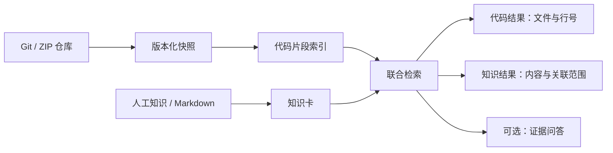

# 代码与知识联合检索：功能与数据流

核对日期：2026-09-11。

## 一句话理解

把代码仓库和团队知识放进同一个可追溯的搜索入口，帮助开发者快速回答“代码在哪、为什么这样写、有哪些相关约束”。

## 最小使用流程

1. 在“项目管理”导入 Git 或 ZIP 仓库。
2. 在“项目总览”准备当前快照，生成带路径和行号的代码片段。
3. 在“知识库”录入说明、规则或决策，并绑定适用路径或符号。
4. 在“代码与知识”输入自然语言、类名、函数名或错误信息。
5. 从同一结果列表打开代码原文或知识卡，核对来源。

## 核心数据流

检索只读取仓库当前已发布快照。代码结果保留文件、符号、行号和片段；知识结果保留卡片标识、状态和代码关联。系统不会把检索结果当作审查结论。

## 页面职责

| 页面 | 作用 | 最小验收点 |
| --- | --- | --- |
| 项目管理 | 导入、同步和选择仓库 | 能产生一个可读取的当前快照 |
| 项目总览 | 准备索引并显示可用状态 | 内容片段数大于 0，可进入联合检索 |
| 代码与知识 | 输入一次查询，混排代码与知识 | 两类结果可区分，且都能打开来源 |
| 知识库 | 维护项目说明、规则及代码范围 | 已发布知识能被联合检索命中 |
| 问项目 | 基于检索证据生成回答 | 回答引用能回到真实文件或知识卡 |
| MCP 接入 | 供 AI 客户端调用同一检索能力 | 只暴露只读 `search_project` 工具 |

## 明确不做

当前版本不包含变更审查、需求影响预估、PR/MR Webhook、审查型 CI、测试/审批判定和任务结果回报。代码关系、向量模型与知识失效提示属于可选增强，不是最小流程的前置条件。

## 结项演示建议

准备一个小仓库和两条知识卡，用同一个业务问题完成三步演示：

1. 搜索问题，展示代码与知识同时出现；
2. 打开代码结果，展示文件、行号和当前快照；
3. 打开知识结果，展示它与路径或符号的关联。

这条链路能够直接证明项目价值：减少在源码、文档和口头知识之间来回查找的时间，同时让结果具备可验证来源。
