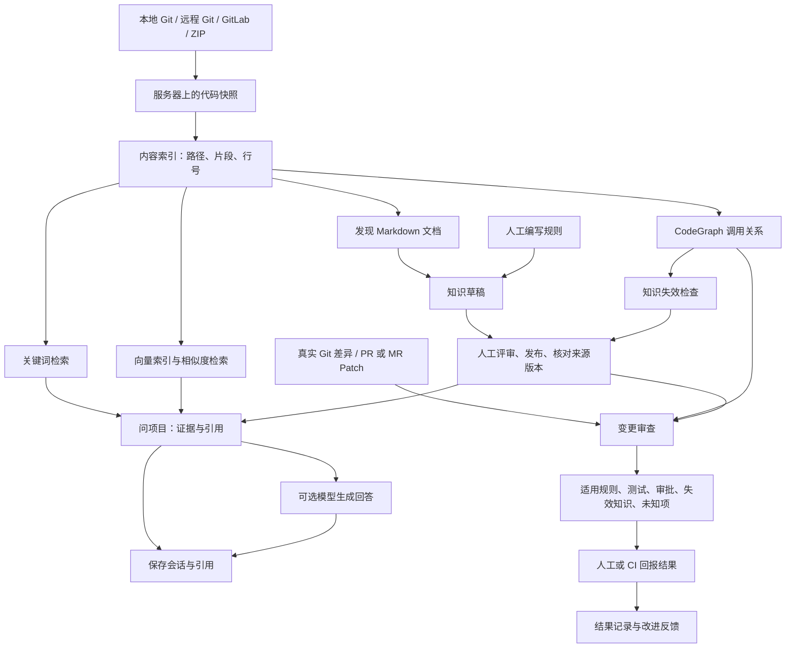

# 整个系统怎么用：功能与数据流简明说明

核对日期：2026-09-07。已随实用化清理更新：删除未接入页面的遗留代码，修复知识只读入口、接入仓库入口、准备状态隔离和统计显示。实际验收方法见 README 中 verify-core；外部模型、远端 PR/MR 和生产部署仍须按环境验收。

## 1. 一句话理解

**把代码仓库接进来，找到真实代码，带着证据问问题，再用团队规则检查代码改动。**

## 2. 第一次只做 5 步

1. **登录**：使用管理员提供的账号；提示改密时先改密码。
2. **接入仓库**：项目管理 → 接入仓库 → 选本地 Git、远程 Git、GitLab 或 ZIP。
3. **准备项目**：项目总览 → 准备项目；先确认“内容索引”有片段。
4. **找到代码**：代码与证据 → 搜索确定存在的类名、函数名或路径 → 点结果看原文。
5. **问一个问题**：问项目 → 选择“本地证据” → 提问 → 核对文件、行号和快照。

之后：**改代码前做影响预估；改代码后做变更审查；把稳定规则写成知识卡，人工审核后发布。**

“本地 Git 路径”是**后端服务器上的路径**，浏览器不会自动读取你电脑上的项目。ZIP 适合阅读与问答；真实 Git 审查还需要可用的 Git 历史或工作区。

## 3. 数据从哪里来、到哪里去

箭头表示数据依赖。实际准备顺序为：**代码快照 → 内容索引 → 向量阶段 → 图谱 → 知识失效检查**。向量降级后仍会继续排队图谱；图谱失败不妨碍已有关键词检索。

三个词：**快照**是平台保存的代码版本；**索引**帮助查找内容；**知识卡**是团队维护的规则或说明。

## 4. 每个功能点怎么用

### 4.1 登录与工作区

| 功能点 | 最短操作 | 数据从哪来 → 到哪去 |
| --- | --- | --- |
| 登录、验证码 | 输入账号密码；出现验证码时作答 | 登录信息 → 后端验证 → 登录会话 |
| 强制改密、退出 | 被要求改密时在登录页完成；离开时退出登录 | 变更请求 → 账号/会话状态 |
| 切换当前仓库 | 顶部选择仓库 | 可见仓库列表 → 当前仓库；选择保存到服务端 |
| 工作区页签 | 打开、切换或关闭页面页签 | 已打开页面 → 当前浏览器保存；刷新可恢复页签 |
| 菜单与按钮权限 | 使用账号可见入口 | 角色 + 仓库权限 → 可见操作；后端再次校验 |

权限记法：**READ 看；MAINTAIN 同步、索引、维护草稿；MANAGE 再加非敏感配置、评审和发布；OWNER 再加授权、凭据、转移和删除；超级管理员管理全局。**

### 4.2 项目管理：把代码接进来

| 功能点 | 最短操作 | 数据从哪来 → 到哪去 |
| --- | --- | --- |
| 本地 Git 接入 | 填名称和服务器允许目录中的绝对路径 | 原始 Git 目录 → 受管快照；不修改原目录 |
| 远程 Git 接入 | 填 HTTPS 地址、分支，按需选凭据 | 远端代码 → 后台导入任务 → 受管仓库与快照 |
| GitLab 接入 | 填 HTTPS 克隆地址、分支和 PAT | GitLab 代码 → 导入与快照流程 |
| ZIP 接入 | 填名称、上传 ZIP | 压缩包 → 校验、解压 → 快照 |
| 查看导入进度 | 等待接入结果；超时后刷新列表 | 后台导入状态 → 提示；页面等待结束不等于任务失败 |
| 搜索仓库 | 按名称、描述、所有者或分支查找 | 已授权仓库记录 → 分页列表 |
| 编辑仓库 | 点“编辑”，改名称、描述、默认分支 | 表单 → 仓库配置；改分支后仍需同步代码 |
| 同步 | 点仓库行“同步” | 本地目录或远端分支 → 新快照；有变化时触发索引 |
| 手动内容索引 | 点“内容索引” | 当前快照 → 全量索引任务 |
| 手动构建图谱 | 更多 → 构建/重新构建代码图谱 | 当前快照 → CodeGraph 任务 → 图谱产物 |
| 创建、编辑、检测凭据 | 接入弹窗或凭据管理中操作 | Token → 加密保存；检测指定远端访问；之后显示掩码 |
| 启用、停用、删除凭据 | 凭据管理中操作 | 凭据状态/绑定校验 → 后续远端访问能力 |
| 绑定、替换、解除凭据 | 编辑仓库 → 凭据绑定 | 仓库与凭据关联 → 同步和 PR/MR 集成使用 |
| 管理成员权限 | 更多 → 成员与所有权 | 选择成员和权限 → 仓库授权记录 |
| 转移所有权 | 选择新所有者和原所有者后续权限 | 旧 OWNER → 新 OWNER |
| 删除仓库 | 更多 → 删除仓库 | 先隐藏 → 后台清理受管代码与派生数据；保留外部本地原目录 |

### 4.3 项目总览：确认准备到了哪一步

| 功能点 | 最短操作 | 数据从哪来 → 到哪去 |
| --- | --- | --- |
| 看当前版本 | 看分支、Commit、快照和未发布变化提示 | 仓库版本记录 → 总览 |
| 一键准备/检查更新 | 点准备、检查更新或修复准备状态 | 代码源 → 快照、内容、向量、图谱、知识检查 |
| 重试失败阶段 | 对应阶段点“重试此阶段” | 当前快照 + 配置 → 新任务；向量重试走索引任务 |
| 看核心数据 | 看图谱、向量、可信知识、代码文件 | 后端统计 → 数量/覆盖率；不是模型评分 |
| 看代码类型 | 看分类与样例路径 | 当前快照路径与内容分类 → 类型计数 |
| 看知识真实性 | 看当前、待复核、已失效、未验证 | 来源版本状态 → 分类统计 |
| 看知识治理缺口 | 看可信、未审核、必需但无负责人 | 发布、评审、版本、负责人 → 治理统计 |
| 看阻塞并处理 | 点处理准备状态或处理知识 | 后端发现的缺口 → 准备流程或知识治理 |
| 看最近审查 | 阅读摘要；到变更审查历史打开详情 | 最近审查记录 → 版本与证据摘要 |
| 开始审查、刷新 | 点对应按钮 | 当前快照与内容索引条件 → 审查页；刷新重新读状态 |

**向量 100% 只代表当前代码片段的有效向量覆盖，不代表知识已审核、图谱完整或答案正确。**

### 4.4 代码与证据：找到原文并追溯关系

| 功能点 | 最短操作 | 数据从哪来 → 到哪去 |
| --- | --- | --- |
| 文件树浏览 | 展开目录、选择文件 | 当前快照清单 → 文件树与源码 |
| 检索路径、符号、正文 | 输入关键词 → 检索 | 当前快照片段 + 可用通道 → 命中结果 |
| 定位源码 | 点结果 | 文件和行号 → 原文位置 |
| Markdown 预览 | 切换源码/渲染 | 当前文档 → 安全渲染预览 |
| 检索诊断 | 查看召回通道与降级信息 | 查询过程 → 快照、通道、耗时和限制 |
| 调用关系 | 打开关系证据，指定符号与深度后查询 | 当前 CodeGraph → 调用路径和位置 |
| 构建缺失图谱 | 有权限时提交构建，完成后刷新 | 当前版本 → 图谱任务 → 图谱产物 |
| 关联知识 | 切换知识证据页签 | 直接绑定该文件的知识 → 卡片信息；不是全部适用规则 |
| 审查引用 | 切换审查证据页签 | 保存的审查记录 → 文件被引用的角色与来源；扫描有上限 |
| 证据跳转源码 | 点击路径或符号 | 引用坐标 → 当前源码；旧证据需按自身版本阅读 |

当前只读源码，没有在线编辑、保存、提交。静态图谱对反射、运行时分派等关系可能覆盖不足。

### 4.5 问项目：用证据回答问题

| 功能点 | 最短操作 | 数据从哪来 → 到哪去 |
| --- | --- | --- |
| 本地证据回答 | 选本地证据，输入问题 | 问题 → 代码与可检索的已发布知识 → 摘录、来源和引用 |
| 模型回答 | 选检测可用的模型后提问 | 问题、最近上下文、脱敏证据 → 所选模型 → 回答与引用 |
| 多轮追问 | 在当前会话继续提问 | 当前问题 + 最近会话内容 → 检索消歧与回答 |
| 新会话 | 点新会话 | 清空当前会话选择 → 下一问题创建新会话 |
| 核对引用 | 选择某轮回答并打开证据 | 保存的引用 → 路径、行号、快照、内容、来源状态 |
| 检索和模型状态 | 展开诊断 | 通道/模型执行结果 → 降级原因与限制 |
| 失败重试 | 在失败提示中重试 | 同一请求标识与问题 → 重试/幂等处理 |
| 恢复、重命名、删除历史 | 在会话历史中操作 | 当前账号、仓库的会话 → 恢复展示或更新记录 |

本地证据不调用聊天模型，也不是离线大模型；如果启用了外部向量模型，检索仍可能调用该服务。模型调用失败可退回证据回答；证据不足会说明不足。没有流式回答、停止生成和断线续传。

### 4.6 变更审查：改前调查，改后检查

| 功能点 | 最短操作 | 数据从哪来 → 到哪去 |
| --- | --- | --- |
| 需求影响预估 | 切到需求影响预估，描述想改什么 | 任务 → 模型或规则解析 → 当前快照检索与一跳依赖线索 |
| 预估候选核验 | 标为相关或排除 | 人工判断 → 当前页面状态；可复制，未找到服务端保存链路 |
| 复制范围、继续问项目 | 点复制或继续问答 | 已确认文件 + 任务 → 剪贴板或问答输入；不自动改代码 |
| 工作区审查 | 选工作区 → 开始审查 | 服务器仓库的暂存、未暂存、未跟踪变化 → 差异审查 |
| 单次提交审查 | 选单次提交，填 Commit | 指定 Git 提交 → 文件、行段、符号变化 |
| 提交范围审查 | 填起止 Commit | 两个 Git 版本 → 真实差异与审查结果 |
| PR/MR 审查 | 选 GitHub/GitLab，填编号等信息 | 绑定凭据 → 远端 Patch/Head → 审查 → 创建/更新远端提示评论 |
| 可选引用总结 | 选择总结模型 | 已有审查事实 → 模型总结；不改变确定性结论 |
| 适用知识与参考知识 | 阅读证据主线 | 真实变化 + 已审核知识范围 → 确定命中；关键词相似项仅参考 |
| 测试与审批要求 | 阅读必须测试、必要审批 | 命中的知识义务 → 待完成清单；不自动执行测试或审批 |
| 失效知识与未知项 | 阅读面板并打开证据 | 来源版本、变化、分析限制 → 过期规则和无法确认事项 |
| 历史审查 | 点历史记录 | 保存结果 → 创建时的版本与证据；不会自动更新为新版本 |
| 回报开发结果 | 填最终 Commit、摘要、测试、审批状态 | 人工提交 → 不可编辑的结果记录；纠正时追加 |
| 误报、漏报、知识更新反馈 | 在结果回报中选择/填写 | 审查结论 + 具名反馈 → 改进记录；不自动修改知识 |

**PR/MR 版本边界：**当前允许 Head 尚未成为平台快照时继续审查，并记录 `PR_HEAD_NOT_INDEXED`，同时尝试获取该 Head 源码。知识和架构仍基于平台已发布快照。获取到的 Head 与提供方声明不一致会终止；Head 源码获取失败可降为文件级事实。必须核对每类证据版本。

**回报边界：**最终 Commit 与审查 Head 相同才是精确绑定；不同则是报告人的具名声明，当前不自动证明 Git 祖先关系。

### 4.7 知识治理：让规则参与审查

| 功能点 | 最短操作 | 数据从哪来 → 到哪去 |
| --- | --- | --- |
| 查找知识卡 | 按标题/类型筛选 | 当前仓库知识 → 卡片列表 |
| 新建、编辑卡片 | 填标题、正文、分类、标签后保存 | 人工内容 → 新修订草稿 + 未评审 |
| 工程知识类型 | 选择参考资料、业务规则等 | 人工分类 → 卡片类型；不自动生成规则 |
| 严重程度与执行级别 | 选提示/警告/严重、参考/建议/必须 | 人工规则强度 → 审查展示与义务判断 |
| 适用范围 | 填路径、符号、模块，按需选跨仓范围 | 明确范围 → 审查匹配条件 |
| 绑定代码来源 | 搜索代码并加入引用 | 当前片段 → 卡片版本证据；来源绑定不等于适用范围 |
| 测试和审批 | 填测试标识/要求，选择审批账号 | 知识义务 → 命中后生成测试/审批要求 |
| CI 约束 | 填禁止路径、知识同步要求 | 必须执行的规则 → CI 检查 |
| 负责人 | 选择成员或设为我 | 账号 → 维护责任；必需知识发布需要负责人和范围 |
| 图片与附件 | 上传、插入图片，或从修订中移除 | 文件 → 受管附件 + 修订关联；不是自动全文解析 |
| 详情、关联代码 | 点查看或源码链接 | 卡片修订和引用 → 正文、范围、义务、源码 |
| 通过评审、要求修改 | 管理者点对应操作 | 人工判断 → 评审状态；不自动发布 |
| 发布、撤回 | 审核通过后发布，必要时撤回 | 发布状态 → 可检索资格；发布时尝试补建知识向量 |
| 历史、恢复草稿 | 历史 → 恢复为新草稿 | 历史修订 → 新草稿；需重新评审发布 |
| Markdown 来源 | 切到 Markdown，按标题/路径/状态筛选 | 内容索引发现的文档 → 待生成/已生成/过期列表 |
| Markdown 生成卡片 | 单篇生成，或批量生成待处理文档 | 对应快照正文与指纹 → 草稿；不是模型自动认定 |
| 更新过期 Markdown 卡片 | 从来源重新生成并核对 | 新文档版本 → 更新草稿，重新评审 |
| 查看来源漂移 | 打开卡片详情中的来源漂移 | 原来源与当前代码差异 → 变化原因、提交范围、审计 |
| 确认有效、确认失效 | 核对证据后选状态并写说明 | 人工复核 → 来源版本状态与漂移事件 |

知识类型：参考资料、业务规则、架构决策、接口契约、数据约束、测试义务、安全策略、运行手册、事故经验、责任归属、技术债。

附件支持常见图片、PDF、TXT、Markdown、CSV、JSON、DOCX、XLSX、PPTX。服务层限制：图片 10 MiB、其他文件 50 MiB；每修订最多 20 个、合计 200 MiB。实际上传还受部署请求大小限制。

**可信审查规则必须：已发布、已审核、来源版本 CURRENT，并明确命中本次变化。**生成、保存、来源当前都不能替代人工审核。

### 4.8 跨仓工程项目

| 功能点 | 最短操作 | 数据从哪来 → 到哪去 |
| --- | --- | --- |
| 新建、编辑工程项目 | 项目管理 → 跨仓工程项目 | 至少两个可管理且有快照的仓库 → 工程记录 |
| 仓库与服务名 | 为仓库填项目内唯一服务名 | 人工确认的身份 → 跨仓匹配 |
| 添加、更新契约 | 选提供方/消费方，填双方已索引的真实路径 | 两端内容指纹 → 契约证据 |
| 查看契约是否过期 | 看证据待刷新，更新后重新核对 | 当前指纹对比 → 契约可用状态 |
| 将规则用于其他仓库 | 知识卡选择目标仓库、服务或契约 | 来源知识 + 明确绑定 + 本次变化 → 审查命中；还需满足本地范围 |
| 移除成员、契约、项目 | 先解除知识范围引用，再删除关系 | 引用检查 → 工程关联更新 |

工程分组不会自动发现所有服务调用，也不会让所有规则自动适用于组内仓库。审查创建者须能读取来源仓库。

### 4.9 系统管理

| 功能点 | 最短操作 | 数据从哪来 → 到哪去 |
| --- | --- | --- |
| 索引任务列表 | 索引任务 → 选择任务 | 任务表 → 排队、运行、成功、失败、取消状态 |
| 任务细节 | 查看步骤、执行模式和错误 | 任务记录 → 实际全量/增量模式与回退原因 |
| 取消、重试 | 对支持的任务点对应操作 | 状态请求 → Worker 取消或新建重试任务 |
| 向量索引明细 | 向量索引 → 片段/知识明细 | 当前仓库、快照、有效模型 → 覆盖率及缺失项 |
| 新增、编辑问答模型 | 模型配置 → 问答模型 → 保存备案 | 地址、模型、密钥、参数 → 配置 |
| 检测问答模型 | 点检测 | 后端请求 → 可用状态；供问答与可选总结使用 |
| 新增、编辑、检测向量模型 | 配运行方式、维度后检测 | 本地哈希或外部 embedding → 能力与维度验证 |
| 切换向量模型 | 切换使用，再准备/重试向量 | 新模型 → 当前向量空间；旧向量不混用 |
| 创建、编辑、搜索账号 | 账号权限 → 对应操作 | 账号表单 → 资料与角色 |
| 启用、停用、解锁 | 对账号操作 | 账号状态 → 登录与访问能力 |
| 重置密码 | 管理员点重置 | 随机临时密码 → 展示一次，24 小时有效；旧会话撤销，下次强制改密 |
| 审计日志 | 按人、事件、结果、日期筛选 | 已记录事件 → 日志列表；不是所有业务请求的全量追踪 |

当前增量索引已实现：根据 Git 差异替换受影响路径；无基线、未提交工作区、差异读取失败或变更比例超过 35% 时回退全量。文件扫描仍是全量，不能理解为所有计算只处理差异。

本地哈希是 64 维字符相似度；外部 embedding 提供语义向量能力。问答模型按请求选择，向量模型由管理员切换当前使用项。

### 4.10 Agent、Webhook、CI：需要额外接入

这些不是独立菜单页面，需配置调用方。

| 功能点 | 最短使用方式 | 数据从哪来 → 到哪去 |
| --- | --- | --- |
| MCP 接入 | 右上角「MCP 接入」→ 按四步说明准备账户、创建访问令牌、复制远程配置并验证；也可看 mcp-server/README.md | Agent → Java /api/mcp → 账户与仓库权限校验 |
| review_change | 提交仓库与真实 Git 范围 | Git 变化 → 与页面一致的审查 |
| get_task_context | 提交任务，按需提供审查 ID、预算 | 当前快照 + 已完成审查 → 版本化上下文；没审查仅事实、候选、未知项 |
| get_rules_for_symbol | 提供审查与符号 | 审查中确定的命中 → 符号规则 |
| get_required_tests | 提供审查 ID | 保存的测试要求 → Agent 待办 |
| get_stale_knowledge | 提供审查 ID | 隔离的陈旧知识 → 待处理列表 |
| get_evidence | 提供来源 ID | 审查/上下文来源 → 完整证据 |
| report_task_outcome | 提交实际 Commit、结果、反馈 | Agent 具名回报 → 不可变结果记录 |
| GitHub/GitLab Webhook | 部署者配置密钥与事件 URL | 验签事件 → 唯一匹配仓库 → 以 OWNER 身份执行审查与评论 |
| CI 确定性检查 | 给 scripts/ci-task-review.mjs 提供审查 ID、Head、测试和审批报告 | 提交审查 + 外部回报 → PASS/FAIL；退出码 0/1，配置或接口错误为 2 |
| CI 规则内容 | 知识卡设置必须执行的明确义务 | 禁止路径、测试、审批、关键失效知识、知识同步 → 检查；模型和相似度候选仅提示 |

CI 不替你运行测试、收集审批或配置流水线；报告由外部提供，未报告不等于通过。MCP 已支持账户访问令牌；令牌复用账户当前仓库权限，仅用于 MCP 相关工具接口，不能直接用于 CI 等其他接口。

## 5. 数据流不明确、清理状态与仍需验证的功能

| 编号 | 功能/链路 | 现状与不明确之处 | 使用时怎么理解 |
| --- | --- | --- | --- |
| U01 | 旧架构图、模块符号 UI | 未接入页面的组件、composable 与前端 API 已删除 | **已清理**。保留变更分析仍在使用的后端架构服务 |
| U02 | 旧总览 README、资产、Agent 上下文 UI | 未接入当前总览的旧组件及请求包装已删除 | **已清理**。当前总览与实际使用的后端/MCP 上下文能力保留 |
| U03 | 搜索范围文案 | 已改为搜索当前仓库源码、文档或文件路径 | **已校准**。检索返回内容片段，不宣称搜索所有知识卡和审查任务 |
| U04 | READ 用户查看知识 | 已开放证据详情路径；READ 不加载草稿来源，不显示编辑和修订操作 | **已修复**。后端原有读写权限不变 |
| U05 | READ 账号接入新仓库 | 已开放所有登录账号的项目管理入口；仓库行操作仍按权限控制 | **已修复**。可以创建自己的仓库，不增加其他仓库维护权限 |
| U06 | 影响预估确认/排除 | candidateStates 仅在组件内；复制或继续问答才带出，没有保存接口 | **页面内状态**。不是已保存审查，不保证刷新恢复，也不修改正式规则 |
| U07 | PR/MR Head 与知识快照 | 可读新 Head 源码，但知识/架构仍用平台快照；旧指南却要求二者一致 | **多版本输入**。核对证据版本；需要实际 PR/MR 联调降级路径 |
| U08 | 向量失败原因 | 准备与知识发布补向量捕获异常；前者降级，后者仍发布成功 | **错误回传不完整**。发布成功不保证语义检索可用；检查向量明细、检测和日志 |
| U09 | 准备完成是否覆盖知识向量 | 向量阶段主要按代码片段缺失判定；知识发布独立补向量，失败可忽略 | **统计口径缺口**。代码满覆盖不代表知识向量齐全；统一修复流程需验收 |
| U10 | 统计请求失败显示零 | 未获取代码统计时显示“—”与刷新提示 | **已修复**。可区分无数据与未加载 |
| U11 | 准备时切换仓库 | 准备、轮询、重试使用仓库上下文版本；切仓或关闭作用域后不写旧结果 | **已修复**。已补切走再切回、轮询中切仓和关闭页面回归 |
| U12 | 后台中断与后续推进 | 内容索引到图谱入队失败主要写日志；既有审计指出普通索引崩溃恢复证据不足 | **异常恢复待验证**。不能保证遗留 RUNNING 自动恢复或后续任务自动补齐 |
| U13 | 附件进入问答 | 上传、关联、下载已接通；未发现 PDF/Office 自动解析入检索链路 | **能力边界**。上传仅代表可访问；参与规则需整理到知识正文 |
| U14 | 测试、审批从哪来 | 页面/MCP/CI 接收结构化回报，没有自动执行或完整抓取审批闭环 | **需要外部输入**。平台判断回报，不自动证明证据链接内容真实 |
| U15 | 反馈如何改进知识 | 结果和误报漏报保存，不自动编辑/评审/发布 | **人工闭环**。负责人仍需修改并重新发布；自动学习未形成 |
| U16 | 契约与真实跨服务调用 | 人工关联 + 两端指纹，不是运行时调用链或自动兼容性验证 | **能力边界**。契约当前只说明内容未变，不保证接口兼容或实际调用 |
| U17 | 全系统实际可用性 | 独立 PostgreSQL/pgvector 与真实 HTTP 核心验收已通过：登录改密、ZIP 导入、索引、检索、问答、历史引用；向量模型切换与重建通过 | **核心链路已验证**。外部 CodeGraph、模型、PR/MR、生产部署及旧库升级仍需单独验收；见 docs/14-practical-cleanup.md |
| U18 | 旧数据库升级 | 当前仅合并 V1，历史文档曾描述多个迁移版本 | **迁移待确认**。新库初始化与旧库升级不同，需非破坏性演练 |

## 6. 三个最容易误用的地方

1. **查到内容 ≠ 规则已确认。** 搜索命中、模型建议、正式规则的可信度不同。
2. **显示成功 ≠ 全链路完整。** 导入、索引、发布成功分别代表不同阶段；继续看向量、图谱、来源版本和未知项。
3. **写了测试要求 ≠ 测试已执行。** 开发者或 CI 执行后仍需回报。

当前未提供：在线代码编辑/提交/创建 PR、企业 SSO/OIDC、多租户、批量 OWNER 接管、流式问答/停止生成/断线续传。PR/MR 评论不等于自动设置合并阻断状态；CI 门禁需流水线单独接入。

## 7. 维护者核对依据

| 对应内容 | 实现位置 |
| --- | --- |
| 导航与权限入口 | frontend/src/router/index.ts；frontend/src/components/workspaceNavigation.ts |
| 仓库操作 | frontend/src/views/RepositoriesM0View.vue；frontend/src/features/repositories/RepositoryTable.vue |
| 总览挂载与计数回退 | frontend/src/views/ProjectOverviewView.vue；frontend/src/features/overview/ProjectOverviewSheet.vue；frontend/src/features/overview/useProjectOverview.ts |
| 搜索、问答、知识向量 | backend/src/main/java/com/analyzercoder/application/intelligence/IntelligenceService.java：hybridSearchDetailed、prepareRepositoryEmbeddings、setCardPublication、prepareKnowledgeEmbeddingsSafely |
| 准备与阶段依赖 | backend/src/main/java/com/analyzercoder/application/repository/RepositoryPreparationService.java |
| 增量与全量回退 | backend/src/main/java/com/analyzercoder/application/indexing/IndexJobProcessor.java：executionPlan |
| PR/MR 多版本与评论 | backend/src/main/java/com/analyzercoder/application/pullrequest/PullRequestReviewService.java |
| 预估候选页面状态 | frontend/src/features/task-review/ImpactEstimatePanel.vue：candidateStates、copyScope、continueAsk |
| 规则与未知项 | backend/src/main/java/com/analyzercoder/application/review/TaskContextMatcher.java；TaskReviewService.java |
| Markdown 与附件 | backend/src/main/java/com/analyzercoder/application/intelligence/MarkdownKnowledgeSourceService.java；KnowledgeAttachmentService.java |
| Agent 上下文 | backend/src/main/java/com/analyzercoder/application/memory/TaskContextService.java；ProjectContextPackService.java |
| CI 与回报 | backend/src/main/java/com/analyzercoder/application/ci/CiCheckService.java；backend/src/main/java/com/analyzercoder/application/outcome/TaskReviewOutcomeService.java；scripts/ci-task-review.mjs |
| 持久化 | PostgreSQL：账号、任务、片段、向量、知识修订、会话引用、审查回报；受管目录：快照、图谱、附件；浏览器：页签与未提交交互状态 |
| 启动与历史验收边界 | README.md；backend/README.md；mcp-server/README.md；docs/12-data-flow-audit.md |

docs/07-feature-guide.md 已同步修正问答、增量和 PR/MR 的关键旧描述；历史设计与当前页面存在差异时，以本说明及实际源码为准。
