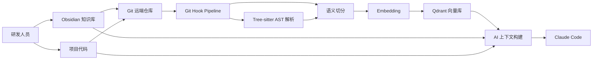
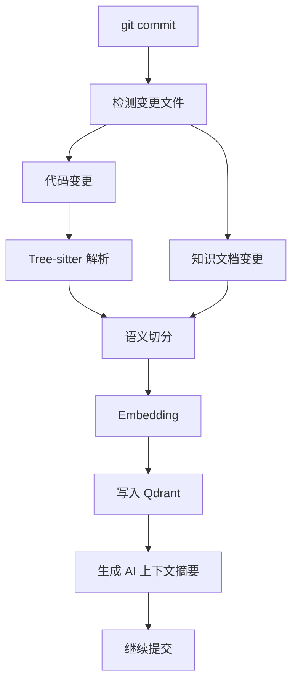
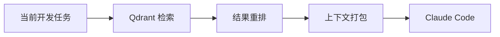

# 企业级 AI 研发知识体系方案

## 目标

构建一套面向企业研发团队的 AI 知识体系，将架构设计、业务规则、故障案例、开发规范、项目代码和历史经验统一沉淀、同步、索引与检索，为 Claude Code 等 AI 编程助手提供持续项目记忆和智能辅助开发能力。

该体系以 Obsidian 作为知识沉淀入口，以 Git 作为版本管理与远端同步机制，以 Tree-sitter 作为代码结构解析基础，以 Embedding 和 Qdrant 作为统一语义检索底座，并通过 Git Hook Pipeline 在研发流程中自动维护索引和上下文。

## 总体架构



## 核心模块

### Obsidian 知识库

Obsidian 用于统一沉淀研发知识，包括：

- 架构设计
- 业务规则
- 故障案例
- 开发规范
- API 约定
- 数据模型说明
- 领域术语
- 决策记录
- 复盘记录

推荐目录结构：

```text
knowledge/
  architecture/
  business-rules/
  incidents/
  coding-standards/
  adr/
  api/
  data-models/
  glossary/
  runbooks/
```

### Git 同步与版本管理

Git 负责知识库与代码的远端同步和版本管理：

- 知识文档随代码一起版本化
- 架构与业务规则变更可追踪
- 故障案例和复盘记录可审计
- 支持分支、评审、回滚和远端同步

推荐将知识库作为项目仓库内目录，或作为独立知识仓库通过 submodule/subtree 引入。

### Tree-sitter AST 解析

Tree-sitter 用于对项目代码进行结构化解析：

- 识别 package/import/class/interface/record/enum
- 识别字段、方法、构造器和调用点
- 识别 Spring Controller、Service、Repository、Mapper
- 识别 HTTP endpoint
- 识别 MyBatis SQL 注解
- 生成稳定的代码 chunk 元数据

解析结果用于后续语义切分、索引和图谱构建。

### 语义切分

语义切分将代码和文档拆成适合检索的最小知识单元：

- 类型级 chunk
- 字段级 chunk
- 方法级 chunk
- HTTP endpoint chunk
- Spring component chunk
- SQL reference chunk
- Markdown heading section chunk
- 故障案例 chunk
- 架构决策 chunk

每个 chunk 需要保留元数据：

```json
{
  "source_type": "code",
  "file_path": "src/main/java/...",
  "package": "com.example",
  "kind": "method",
  "symbol_name": "register",
  "type_name": "UserService",
  "start_line": 27,
  "end_line": 35,
  "tags": ["spring", "registration"]
}
```

### Embedding

Embedding 将代码、文档和经验知识转换为向量表示。

推荐策略：

- 本地开发阶段可使用 deterministic hashing embedding，便于快速验证。
- 企业落地阶段建议使用统一 embedding 模型，保证跨代码、文档、故障案例的检索一致性。
- 代码 chunk 与文档 chunk 使用相同索引空间，但通过 `source_type`、`project`、`module`、`branch` 等字段区分。

### Qdrant 向量库

Qdrant 用于存储统一向量索引。

推荐 collection 设计：

```text
collection: rd_knowledge
```

核心 payload 字段：

```json
{
  "project": "payment-service",
  "branch": "main",
  "commit": "abc123",
  "source_type": "code",
  "doc_type": "method",
  "file_path": "src/main/java/...",
  "symbol_name": "createOrder",
  "module": "order",
  "tags": ["spring", "order"],
  "updated_at": "2026-05-28T00:00:00Z"
}
```

检索场景：

- 查找某个接口的实现位置
- 查找某个业务规则对应的代码
- 查找历史故障案例
- 查找某类异常的处理规范
- 查找相关架构设计和 ADR
- 为 Claude Code 构建项目上下文

## Git Hook Pipeline

Git Hook Pipeline 在提交阶段自动维护知识索引和 AI 上下文。



推荐 Hook 阶段：

- `pre-commit`：快速检测变更、基础解析、轻量索引更新。
- `commit-msg`：根据变更内容辅助生成提交说明或校验提交规范。
- `post-commit`：异步完成完整 embedding、Qdrant upsert 和上下文刷新。
- `pre-push`：确保远端同步前索引状态与知识文档状态一致。

## Claude Code 上下文构建

为 Claude Code 提供的上下文应包含：

- 当前任务相关代码片段
- 相关业务规则
- 相关架构设计
- 相关故障案例
- 当前模块组件图
- 相关接口和调用链
- 开发规范和约束

上下文构建流程：



## 当前项目可复用能力

当前仓库已经具备该体系的部分基础能力：

- Java Tree-sitter 解析
- Java 结构信息提取
- Spring 组件识别
- HTTP endpoint 识别
- MyBatis SQL 注解识别
- 代码 chunk 构建
- Markdown 知识库 chunk 构建
- 本地 JSONL 向量索引
- 本地相似度检索
- Mermaid 图生成
- 项目级 Markdown 报告生成

这些能力可以作为企业级体系的本地原型层，后续替换或扩展为 Qdrant 后端即可进入团队级应用。

## 落地阶段

### 第一阶段：本地原型

目标是完成单项目本地可用闭环。

- 使用 Obsidian 维护知识库目录
- 使用 Git 管理知识文档和代码
- 使用 Tree-sitter 解析 Java 项目
- 使用本地 JSONL 向量库验证索引和检索效果
- 生成项目报告和 Mermaid 图

### 第二阶段：Qdrant 接入

目标是将本地索引升级为团队共享索引。

- 新增 Qdrant 写入和查询模块
- 设计 collection 和 payload schema
- 支持按 project、branch、commit、source_type 过滤
- 支持增量 upsert 和删除失效 chunk
- 接入统一 embedding 模型

### 第三阶段：Git Hook Pipeline

目标是让知识更新进入研发流程。

- 检测变更代码和文档
- 自动解析与切分
- 自动 embedding 和 upsert
- 自动生成项目上下文摘要
- 失败时给出可修复的错误提示

### 第四阶段：Claude Code 集成

目标是让 AI 编程助手具备持续项目记忆。

- 根据当前任务检索相关代码、文档和历史经验
- 自动注入 Claude Code 上下文
- 支持按模块、分支、提交范围检索
- 支持生成设计说明、变更影响分析和测试建议

### 第五阶段：企业治理

目标是支持多团队、多项目、权限和审计。

- 多项目 collection 或 namespace 管理
- 统一标签规范
- 文档质量检查
- 故障案例模板
- 架构决策记录模板
- 权限控制和访问审计
- 索引质量评估

## 关键收益

- 代码、文档和经验统一检索
- 架构知识不再散落在个人记忆中
- 故障经验可复用
- AI 编程助手能理解项目上下文
- 提交阶段自动维护知识索引
- 支持从代码结构生成报告和图
- 降低新人理解项目的成本
- 提升需求开发、问题排查和代码评审效率

## 后续建设建议

优先级建议：

1. 增加 QdrantVectorStore，实现 Qdrant upsert 和 search。
2. 增加 Git diff 增量索引，只处理变更文件。
3. 增加 Obsidian 知识模板，包括 ADR、故障案例、业务规则和开发规范。
4. 增加 Hook 脚本，支持 `pre-commit` 和 `post-commit` 自动更新索引。
5. 增加 Claude Code 上下文包生成命令。
6. 增加索引质量评估命令，检查 chunk 数量、空内容、重复内容和召回效果。
