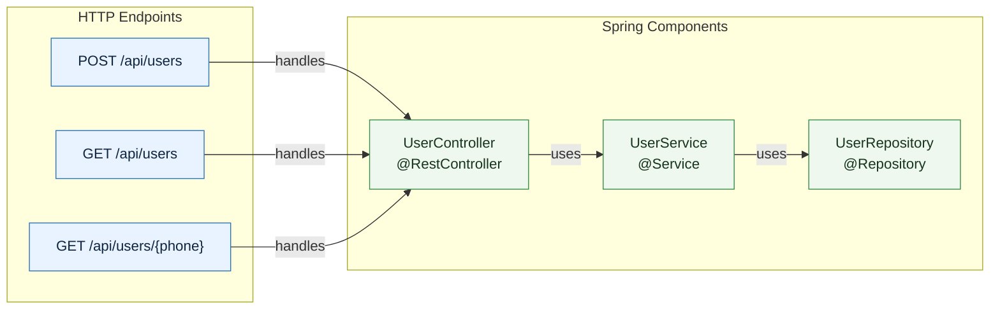

# 项目功能介绍

## 项目概览

本项目当前包含两部分：

- `java-analyzer`：一个基于 Python 和 Tree-sitter 的 Java 静态分析、切块、索引和检索工具。
- `java-demo`：一个位于 `java/` 目录下的小型 Spring Boot 示例项目，用于验证分析器对 Spring 组件、HTTP 接口和调用关系的识别能力。

项目已经形成了从 Java 源码分析、结构化结果输出、向量化索引、检索查询，到 Mermaid 图生成的完整闭环。

## 已实现功能

### 1. Java 静态结构分析

分析器可以读取单个 Java 文件或递归分析目录下的 `.java` 文件，并提取以下信息：

- package 声明
- import 声明，包括 static import 和 wildcard import
- class、interface、enum、record、annotation 类型声明
- 类型修饰符、注解、父类和接口
- 字段类型、修饰符、注解和初始化值
- 方法和构造器
- 方法返回值、参数、签名、修饰符和注解
- 方法调用点，包括调用名、调用者类型、调用者方法、qualifier 和参数数量
- 文件指标，包括行数、类型数、字段数、方法数、调用数、AST 节点数和语法错误数

### 2. Spring Boot 项目识别

分析器已经支持识别常见 Spring 风格代码结构：

- Spring 组件：
  - `@RestController`
  - `@Controller`
  - `@Service`
  - `@Repository`
  - `@Component`
  - `@Mapper`
- Spring MVC HTTP 接口：
  - `@RequestMapping`
  - `@GetMapping`
  - `@PostMapping`
  - `@PutMapping`
  - `@PatchMapping`
  - `@DeleteMapping`
- MyBatis SQL 注解：
  - `@Select`
  - `@Insert`
  - `@Update`
  - `@Delete`
  - Provider variants

当前 `java/` 示例项目分析结果：

| 指标 | 数量 |
|---|---:|
| Java 文件 | 11 |
| Packages | 2 |
| Types | 11 |
| Fields | 9 |
| Methods and constructors | 24 |
| Method calls | 126 |
| HTTP endpoints | 3 |
| SQL references | 0 |

识别到的 Spring 组件：

| 类型 | 名称 | 注解 |
|---|---|---|
| rest_controller | `UserController` | `@RestController` |
| service | `UserService` | `@Service` |
| repository | `UserRepository` | `@Repository` |

识别到的 HTTP 接口：

| 方法 | 路径 | 处理方法 |
|---|---|---|
| POST | `/api/users` | `UserController.register` |
| GET | `/api/users` | `UserController.listUsers` |
| GET | `/api/users/{phone}` | `UserController.findByPhone` |

### 3. 代码切块与向量化索引

项目可以把分析结果转换成可检索的 chunk，包括：

- 类型 chunk
- 字段 chunk
- 方法和构造器 chunk
- Spring 组件 chunk
- HTTP endpoint chunk
- SQL reference chunk
- 知识库文档 chunk

默认使用本地确定性的 hashing embedding，不依赖外部服务。也支持可选的 SentenceTransformer embedding。

索引存储使用 JSONL 文件，支持：

- 写入索引
- upsert 追加更新
- 读取已有索引
- cosine similarity 查询
- 按 `source_type` 过滤代码或知识库结果

### 4. 知识库文档分析

分析器支持对知识库文档进行切块和索引，当前支持格式：

- Markdown：`.md`、`.markdown`
- TXT：`.txt`
- RST：`.rst`
- AsciiDoc：`.adoc`

文档会按标题切分，长文会继续按长度拆分。当前项目中已有知识库文档：

- `docs/user-registration.md`

### 5. CLI 命令行工具

项目提供 `java-analyze` 命令，支持以下能力：

```powershell
java-analyze examples\Sample.java
```

分析单个 Java 文件并输出摘要。

```powershell
java-analyze path\to\java-project --json
```

递归分析目录并输出 JSON。

```powershell
java-analyze examples\Sample.java --tree
```

输出紧凑 AST 语法树。

```powershell
java-analyze examples\Sample.java --chunks
```

输出可向量化的 chunk。

```powershell
java-analyze java --source code --report
```

输出项目级 Markdown 分析报告。

```powershell
java-analyze java --graph
```

根据代码分析结果生成 Mermaid 架构图。

```powershell
java-analyze java --source code --index .vector_store\java.jsonl
```

生成本地 JSONL 向量索引。

```powershell
java-analyze --store .vector_store\java.jsonl --query "register user endpoint" --filter-source code
```

查询本地索引。

### 6. Mermaid 图生成

项目可以根据代码直接生成 Mermaid 图，当前 `java/` 项目生成的结构如下：



依赖关系主要来自字段类型和构造器参数推断。

## Spring Boot 示例项目

`java/` 目录是一个小型 Spring Boot 3.3.5 项目，使用 Java 17 和 Maven。

已实现的业务是用户注册：

- 创建用户
- 查询用户列表
- 按手机号查询用户
- 手机号重复时返回冲突错误
- 请求参数校验

API：

| 方法 | 路径 | 说明 |
|---|---|---|
| POST | `/api/users` | 创建用户 |
| GET | `/api/users` | 查询用户列表 |
| GET | `/api/users/{phone}` | 按手机号查询用户 |

核心类：

- `DemoApplication`：Spring Boot 启动类
- `UserController`：REST API
- `UserService`：用户注册业务逻辑
- `UserRepository`：基于内存 Map 的用户存储
- `DuplicatePhoneException`：重复手机号异常
- `GlobalExceptionHandler`：全局异常处理
- `User`：用户响应模型
- `UserRegistrationRequest`：用户注册请求模型

## 测试状态

当前项目有两组测试。

Python 分析器测试：

```text
8 passed
```

覆盖内容：

- Java 结构抽取
- Spring 和 MyBatis 识别
- 代码 chunk 生成
- JSONL 向量索引和搜索
- 知识库文档与代码混合检索
- CLI 报告输出
- CLI Mermaid 图输出

Spring Boot 示例项目测试：

```text
Tests run: 5, Failures: 0, Errors: 0, Skipped: 0
BUILD SUCCESS
```

覆盖内容：

- 用户注册成功
- 重复手机号冲突
- 请求参数校验
- 按手机号查询
- 用户列表查询

## 当前项目价值

当前项目已经可以作为一个轻量级 Java 代码理解工具使用。它适合：

- 快速扫描 Java 项目结构
- 识别 Spring Boot 入口和组件
- 抽取 Controller、Service、Repository 的关系
- 生成项目级 Markdown 报告
- 生成 Mermaid 架构图
- 将代码和知识库文档一起索引
- 通过本地向量库查询代码和文档

## 当前限制

- 默认 hashing embedding 更适合轻量、本地、确定性检索，不等同于真实语义向量检索。
- 跨文件调用关系目前主要依赖字段类型、构造器参数和方法调用文本推断。
- SQL 识别当前覆盖 MyBatis 注解形式，不解析 XML Mapper 或运行时 SQL。
- Spring endpoint 识别覆盖常见 mapping 注解，复杂 SpEL、常量路径拼接等场景暂未展开。
- 图生成目前聚焦 endpoint、component、SQL reference，不包含完整方法级调用图。

## 常用命令

安装 Python 分析器：

```powershell
python -m venv .venv
.\.venv\Scripts\Activate.ps1
python -m pip install -e ".[dev]"
```

运行 Python 测试：

```powershell
.\.venv\Scripts\python.exe -m pytest
```

分析 Spring Boot 示例项目：

```powershell
.\.venv\Scripts\python.exe -m java_analyzer.cli java --source code --report
```

生成 Mermaid 图：

```powershell
.\.venv\Scripts\python.exe -m java_analyzer.cli java --graph
```

运行 Spring Boot 示例项目测试：

```powershell
cd java
mvn --settings settings.xml test
```

启动 Spring Boot 示例项目：

```powershell
cd java
mvn --settings settings.xml spring-boot:run
```
